# Diagram UML Kinetra

Dokumen ini berisi empat diagram UML utama untuk proyek Kinetra:

1. Use Case Diagram
2. Activity Diagram
3. Class Diagram
4. Sequence Diagram

Diagram dibuat dengan Mermaid agar dapat dirender langsung di Markdown. Selain pengguna aplikasi, diagram juga melibatkan teknologi eksternal yang digunakan proyek: Google ML Kit, Firebase Authentication, dan Firebase Firestore.

## 1. Use Case Diagram

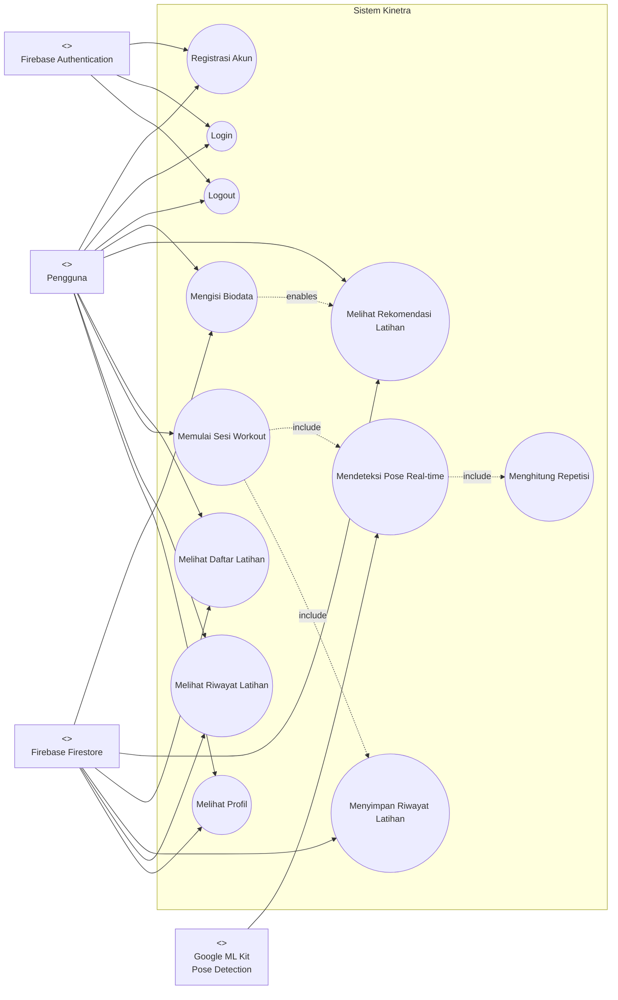
```mermaid
flowchart LR
    Pengguna["<<actor>>\nPengguna"]
    MLKit["<<actor>>\nGoogle ML Kit\nPose Detection"]
    FirebaseAuth["<<actor>>\nFirebase Authentication"]
    Firestore["<<actor>>\nFirebase Firestore"]

    subgraph Sistem["Sistem Kinetra"]
        UCRegister(("Registrasi Akun"))
        UCLogin(("Login"))
        UCLogout(("Logout"))
        UCCompleteBiodata(("Mengisi Biodata"))
        UCRecommendation(("Melihat Rekomendasi Latihan"))
        UCBrowseWorkout(("Melihat Daftar Latihan"))
        UCStartWorkout(("Memulai Sesi Workout"))
        UCPoseDetection(("Mendeteksi Pose Real-time"))
        UCCountRep(("Menghitung Repetisi"))
        UCSaveHistory(("Menyimpan Riwayat Latihan"))
        UCViewHistory(("Melihat Riwayat Latihan"))
        UCViewProfile(("Melihat Profil"))
    end

    Pengguna --> UCRegister
    Pengguna --> UCLogin
    Pengguna --> UCLogout
    Pengguna --> UCCompleteBiodata
    Pengguna --> UCRecommendation
    Pengguna --> UCBrowseWorkout
    Pengguna --> UCStartWorkout
    Pengguna --> UCViewHistory
    Pengguna --> UCViewProfile

    FirebaseAuth --> UCRegister
    FirebaseAuth --> UCLogin
    FirebaseAuth --> UCLogout

    Firestore --> UCCompleteBiodata
    Firestore --> UCRecommendation
    Firestore --> UCBrowseWorkout
    Firestore --> UCSaveHistory
    Firestore --> UCViewHistory
    Firestore --> UCViewProfile

    MLKit --> UCPoseDetection

    UCStartWorkout -. include .-> UCPoseDetection
    UCPoseDetection -. include .-> UCCountRep
    UCStartWorkout -. include .-> UCSaveHistory
    UCCompleteBiodata -. enables .-> UCRecommendation
```

## 2. Activity Diagram

Activity diagram berikut dipecah per use case agar setiap kebutuhan pengguna memiliki alur proses sendiri. Swimlane dibuat sebagai subgraph untuk menunjukkan peran Pengguna, Aplikasi Flutter Kinetra, Firebase Authentication, Firebase Firestore, dan Google ML Kit pada use case yang relevan.

### 2.1 Activity Diagram - Registrasi Akun

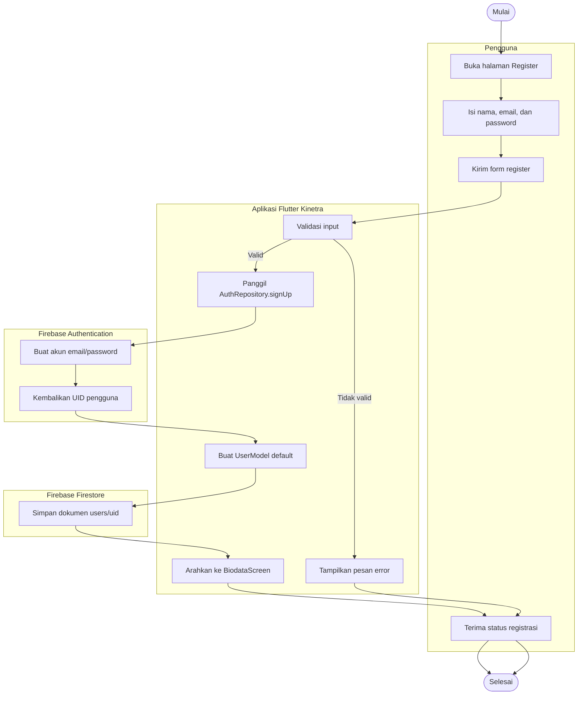
```mermaid
flowchart TD
    Start([Mulai])
    subgraph User["Pengguna"]
        OpenRegister[Buka halaman Register]
        FillRegister[Isi nama, email, dan password]
        SubmitRegister[Kirim form register]
        ReceiveResult[Terima status registrasi]
    end
    subgraph App["Aplikasi Flutter Kinetra"]
        ValidateInput[Validasi input]
        CallSignUp[Panggil AuthRepository.signUp]
        CreateUserModel[Buat UserModel default]
        RedirectBiodata[Arahkan ke BiodataScreen]
        ShowError[Tampilkan pesan error]
    end
    subgraph Auth["Firebase Authentication"]
        CreateCredential[Buat akun email/password]
        ReturnUid[Kembalikan UID pengguna]
    end
    subgraph DB["Firebase Firestore"]
        SaveUser[Simpan dokumen users/uid]
    end

    Start --> OpenRegister --> FillRegister --> SubmitRegister --> ValidateInput
    ValidateInput -->|Valid| CallSignUp --> CreateCredential --> ReturnUid --> CreateUserModel --> SaveUser --> RedirectBiodata --> ReceiveResult --> End([Selesai])
    ValidateInput -->|Tidak valid| ShowError --> ReceiveResult --> End
```

### 2.2 Activity Diagram - Login

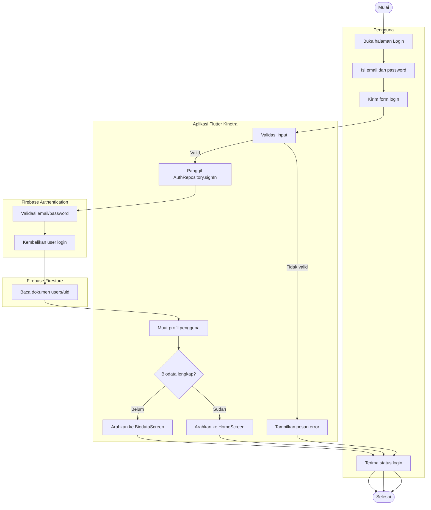
```mermaid
flowchart TD
    Start([Mulai])
    subgraph User["Pengguna"]
        OpenLogin[Buka halaman Login]
        FillLogin[Isi email dan password]
        SubmitLogin[Kirim form login]
        ReceiveResult[Terima status login]
    end
    subgraph App["Aplikasi Flutter Kinetra"]
        ValidateInput[Validasi input]
        CallSignIn[Panggil AuthRepository.signIn]
        LoadUserProfile[Muat profil pengguna]
        CheckBiodata{Biodata lengkap?}
        GoBiodata[Arahkan ke BiodataScreen]
        GoHome[Arahkan ke HomeScreen]
        ShowError[Tampilkan pesan error]
    end
    subgraph Auth["Firebase Authentication"]
        VerifyCredential[Validasi email/password]
        ReturnAuthState[Kembalikan user login]
    end
    subgraph DB["Firebase Firestore"]
        ReadUser[Baca dokumen users/uid]
    end

    Start --> OpenLogin --> FillLogin --> SubmitLogin --> ValidateInput
    ValidateInput -->|Valid| CallSignIn --> VerifyCredential --> ReturnAuthState --> ReadUser --> LoadUserProfile --> CheckBiodata
    CheckBiodata -->|Belum| GoBiodata --> ReceiveResult --> End([Selesai])
    CheckBiodata -->|Sudah| GoHome --> ReceiveResult --> End
    ValidateInput -->|Tidak valid| ShowError --> ReceiveResult --> End
```

### 2.3 Activity Diagram - Logout

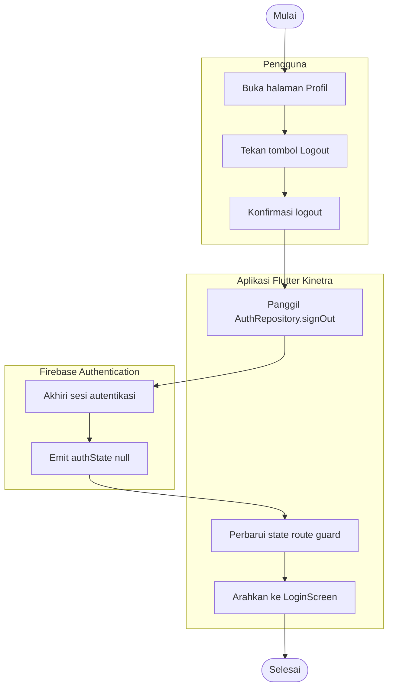
```mermaid
flowchart TD
    Start([Mulai])
    subgraph User["Pengguna"]
        OpenProfile[Buka halaman Profil]
        TapLogout[Tekan tombol Logout]
        ConfirmLogout[Konfirmasi logout]
    end
    subgraph App["Aplikasi Flutter Kinetra"]
        CallSignOut[Panggil AuthRepository.signOut]
        ClearRouteState[Perbarui state route guard]
        GoLogin[Arahkan ke LoginScreen]
    end
    subgraph Auth["Firebase Authentication"]
        EndSession[Akhiri sesi autentikasi]
        EmitNull[Emit authState null]
    end

    Start --> OpenProfile --> TapLogout --> ConfirmLogout --> CallSignOut --> EndSession --> EmitNull --> ClearRouteState --> GoLogin --> End([Selesai])
```

### 2.4 Activity Diagram - Mengisi Biodata

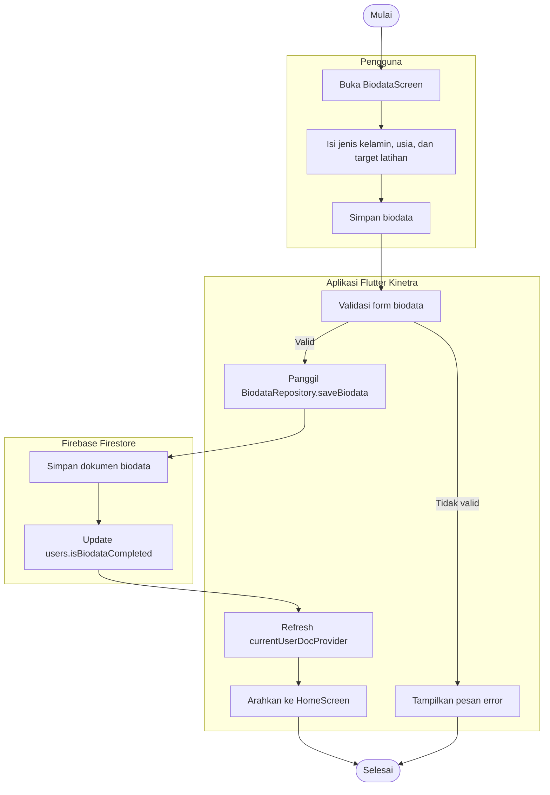
```mermaid
flowchart TD
    Start([Mulai])
    subgraph User["Pengguna"]
        OpenBiodata[Buka BiodataScreen]
        FillBiodata[Isi jenis kelamin, usia, dan target latihan]
        SubmitBiodata[Simpan biodata]
    end
    subgraph App["Aplikasi Flutter Kinetra"]
        ValidateBiodata[Validasi form biodata]
        CallSave[Panggil BiodataRepository.saveBiodata]
        RefreshUserDoc[Refresh currentUserDocProvider]
        GoHome[Arahkan ke HomeScreen]
        ShowError[Tampilkan pesan error]
    end
    subgraph DB["Firebase Firestore"]
        WriteBiodata[Simpan dokumen biodata]
        UpdateUser[Update users.isBiodataCompleted]
    end

    Start --> OpenBiodata --> FillBiodata --> SubmitBiodata --> ValidateBiodata
    ValidateBiodata -->|Valid| CallSave --> WriteBiodata --> UpdateUser --> RefreshUserDoc --> GoHome --> End([Selesai])
    ValidateBiodata -->|Tidak valid| ShowError --> End
```

### 2.5 Activity Diagram - Melihat Rekomendasi Latihan

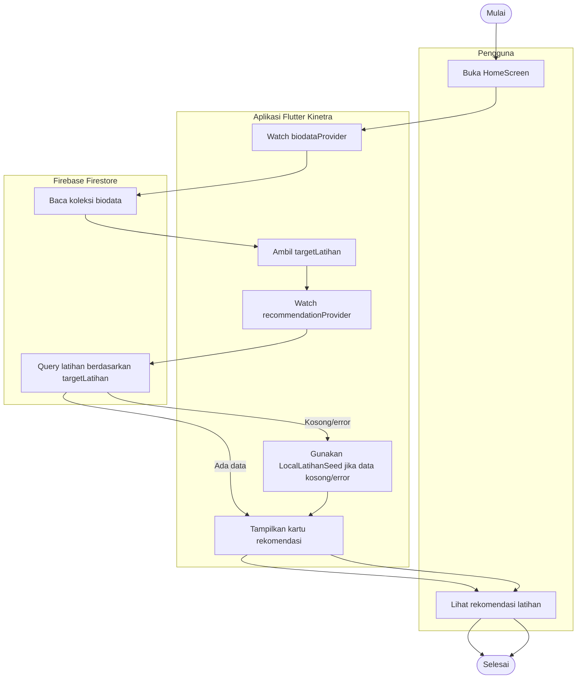
```mermaid
flowchart TD
    Start([Mulai])
    subgraph User["Pengguna"]
        OpenHome[Buka HomeScreen]
        ViewRecommendation[Lihat rekomendasi latihan]
    end
    subgraph App["Aplikasi Flutter Kinetra"]
        WatchBiodata[Watch biodataProvider]
        ReadTarget[Ambil targetLatihan]
        WatchRecommendation[Watch recommendationProvider]
        RenderCards[Tampilkan kartu rekomendasi]
        UseFallback[Gunakan LocalLatihanSeed jika data kosong/error]
    end
    subgraph DB["Firebase Firestore"]
        ReadBiodata[Baca koleksi biodata]
        QueryLatihan[Query latihan berdasarkan targetLatihan]
    end

    Start --> OpenHome --> WatchBiodata --> ReadBiodata --> ReadTarget --> WatchRecommendation --> QueryLatihan
    QueryLatihan -->|Ada data| RenderCards --> ViewRecommendation --> End([Selesai])
    QueryLatihan -->|Kosong/error| UseFallback --> RenderCards --> ViewRecommendation --> End
```

### 2.6 Activity Diagram - Melihat Daftar Latihan

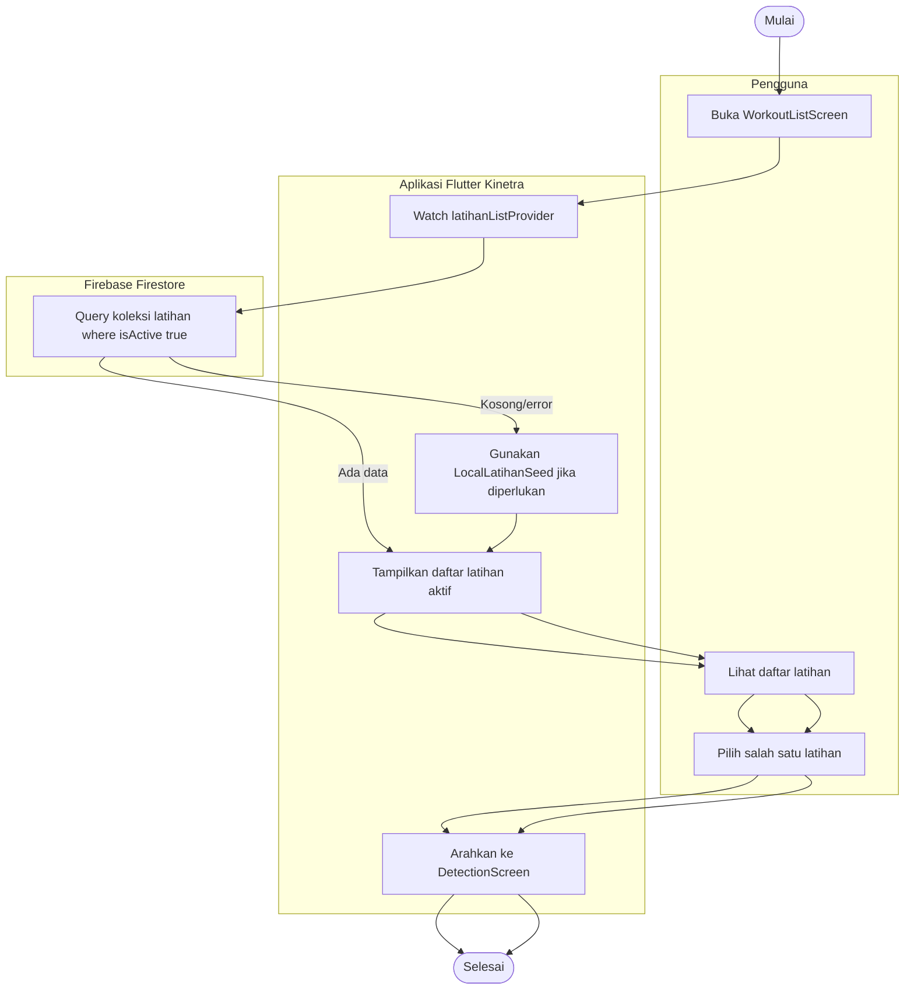
```mermaid
flowchart TD
    Start([Mulai])
    subgraph User["Pengguna"]
        OpenWorkoutList[Buka WorkoutListScreen]
        BrowseList[Lihat daftar latihan]
        SelectWorkout[Pilih salah satu latihan]
    end
    subgraph App["Aplikasi Flutter Kinetra"]
        WatchLatihan[Watch latihanListProvider]
        RenderWorkoutList[Tampilkan daftar latihan aktif]
        GoDetection[Arahkan ke DetectionScreen]
        UseFallback[Gunakan LocalLatihanSeed jika diperlukan]
    end
    subgraph DB["Firebase Firestore"]
        QueryActiveLatihan[Query koleksi latihan where isActive true]
    end

    Start --> OpenWorkoutList --> WatchLatihan --> QueryActiveLatihan
    QueryActiveLatihan -->|Ada data| RenderWorkoutList --> BrowseList --> SelectWorkout --> GoDetection --> End([Selesai])
    QueryActiveLatihan -->|Kosong/error| UseFallback --> RenderWorkoutList --> BrowseList --> SelectWorkout --> GoDetection --> End
```

### 2.7 Activity Diagram - Memulai Sesi Workout

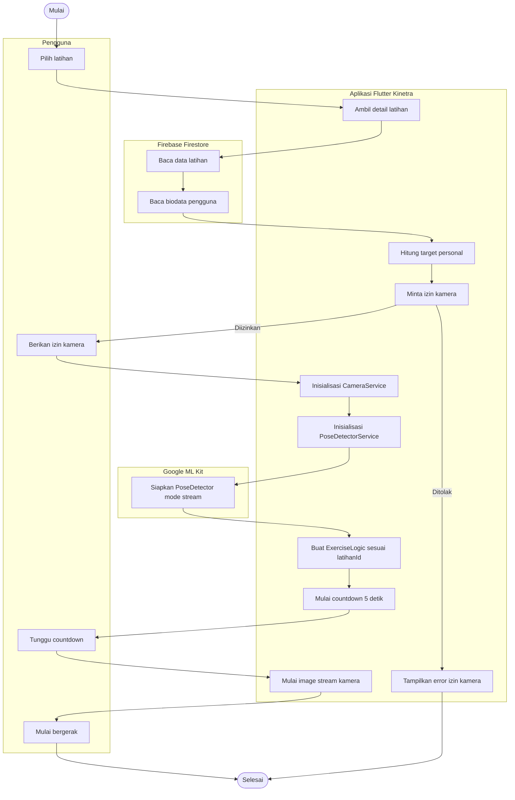
```mermaid
flowchart TD
    Start([Mulai])
    subgraph User["Pengguna"]
        ChooseWorkout[Pilih latihan]
        GrantPermission[Berikan izin kamera]
        WaitCountdown[Tunggu countdown]
        StartMoving[Mulai bergerak]
    end
    subgraph App["Aplikasi Flutter Kinetra"]
        LoadLatihan[Ambil detail latihan]
        CalculateTarget[Hitung target personal]
        RequestCameraPermission[Minta izin kamera]
        InitCamera[Inisialisasi CameraService]
        InitPoseDetector[Inisialisasi PoseDetectorService]
        CreateLogic[Buat ExerciseLogic sesuai latihanId]
        StartCountdown[Mulai countdown 5 detik]
        StartImageStream[Mulai image stream kamera]
        ShowPermissionError[Tampilkan error izin kamera]
    end
    subgraph DB["Firebase Firestore"]
        ReadLatihan[Baca data latihan]
        ReadBiodata[Baca biodata pengguna]
    end
    subgraph MLKit["Google ML Kit"]
        PrepareDetector[Siapkan PoseDetector mode stream]
    end

    Start --> ChooseWorkout --> LoadLatihan --> ReadLatihan --> ReadBiodata --> CalculateTarget --> RequestCameraPermission
    RequestCameraPermission -->|Diizinkan| GrantPermission --> InitCamera --> InitPoseDetector --> PrepareDetector --> CreateLogic --> StartCountdown --> WaitCountdown --> StartImageStream --> StartMoving --> End([Selesai])
    RequestCameraPermission -->|Ditolak| ShowPermissionError --> End
```

### 2.8 Activity Diagram - Mendeteksi Pose Real-time

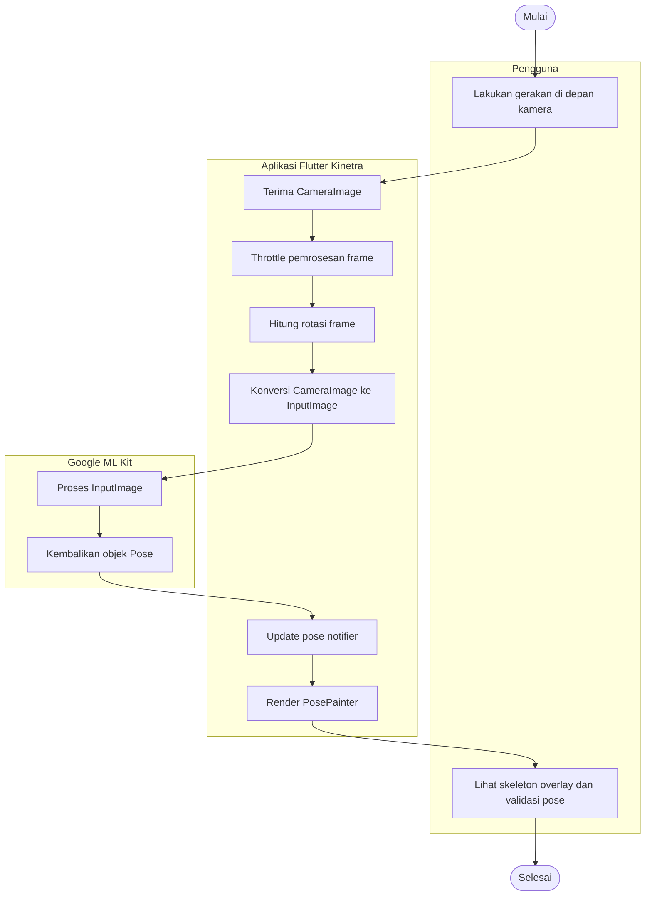
```mermaid
flowchart TD
    Start([Mulai])
    subgraph User["Pengguna"]
        MoveBody[Lakukan gerakan di depan kamera]
        SeeOverlay[Lihat skeleton overlay dan validasi pose]
    end
    subgraph App["Aplikasi Flutter Kinetra"]
        ReceiveFrame[Terima CameraImage]
        ComputeRotation[Hitung rotasi frame]
        ConvertImage[Konversi CameraImage ke InputImage]
        UpdatePoseNotifier[Update pose notifier]
        RenderOverlay[Render PosePainter]
        ThrottleFrame[Throttle pemrosesan frame]
    end
    subgraph MLKit["Google ML Kit"]
        ProcessImage[Proses InputImage]
        ReturnPose[Kembalikan objek Pose]
    end

    Start --> MoveBody --> ReceiveFrame --> ThrottleFrame --> ComputeRotation --> ConvertImage --> ProcessImage --> ReturnPose --> UpdatePoseNotifier --> RenderOverlay --> SeeOverlay --> End([Selesai])
```

### 2.9 Activity Diagram - Menghitung Repetisi

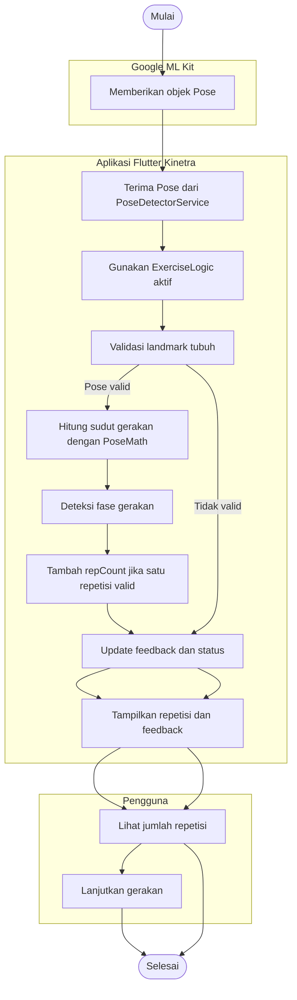
```mermaid
flowchart TD
    Start([Mulai])
    subgraph MLKit["Google ML Kit"]
        ProvidePose[Memberikan objek Pose]
    end
    subgraph App["Aplikasi Flutter Kinetra"]
        ReceivePose[Terima Pose dari PoseDetectorService]
        ChooseLogic[Gunakan ExerciseLogic aktif]
        ValidateLandmark[Validasi landmark tubuh]
        CalculateAngle[Hitung sudut gerakan dengan PoseMath]
        DetectPhase[Deteksi fase gerakan]
        IncrementRep[Tambah repCount jika satu repetisi valid]
        UpdateFeedback[Update feedback dan status]
        ShowStats[Tampilkan repetisi dan feedback]
    end
    subgraph User["Pengguna"]
        ContinueMovement[Lanjutkan gerakan]
        SeeStats[Lihat jumlah repetisi]
    end

    Start --> ProvidePose --> ReceivePose --> ChooseLogic --> ValidateLandmark
    ValidateLandmark -->|Pose valid| CalculateAngle --> DetectPhase --> IncrementRep --> UpdateFeedback --> ShowStats --> SeeStats --> ContinueMovement --> End([Selesai])
    ValidateLandmark -->|Tidak valid| UpdateFeedback --> ShowStats --> SeeStats --> End
```

### 2.10 Activity Diagram - Menyimpan Riwayat Latihan

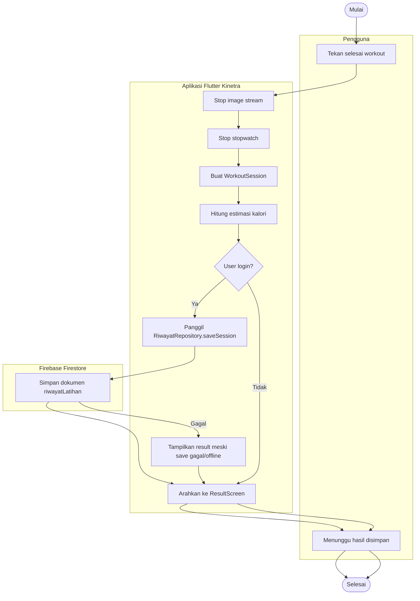
```mermaid
flowchart TD
    Start([Mulai])
    subgraph User["Pengguna"]
        FinishWorkout[Tekan selesai workout]
        SeeSaving[Menunggu hasil disimpan]
    end
    subgraph App["Aplikasi Flutter Kinetra"]
        StopStream[Stop image stream]
        StopStopwatch[Stop stopwatch]
        BuildSession[Buat WorkoutSession]
        EstimateCalories[Hitung estimasi kalori]
        CheckUser{User login?}
        SaveSession[Panggil RiwayatRepository.saveSession]
        GoResult[Arahkan ke ResultScreen]
        ContinueOffline[Tampilkan result meski save gagal/offline]
    end
    subgraph DB["Firebase Firestore"]
        WriteHistory[Simpan dokumen riwayatLatihan]
    end

    Start --> FinishWorkout --> StopStream --> StopStopwatch --> BuildSession --> EstimateCalories --> CheckUser
    CheckUser -->|Ya| SaveSession --> WriteHistory --> GoResult --> SeeSaving --> End([Selesai])
    CheckUser -->|Tidak| GoResult --> SeeSaving --> End
    WriteHistory -->|Gagal| ContinueOffline --> GoResult
```

### 2.11 Activity Diagram - Melihat Riwayat Latihan

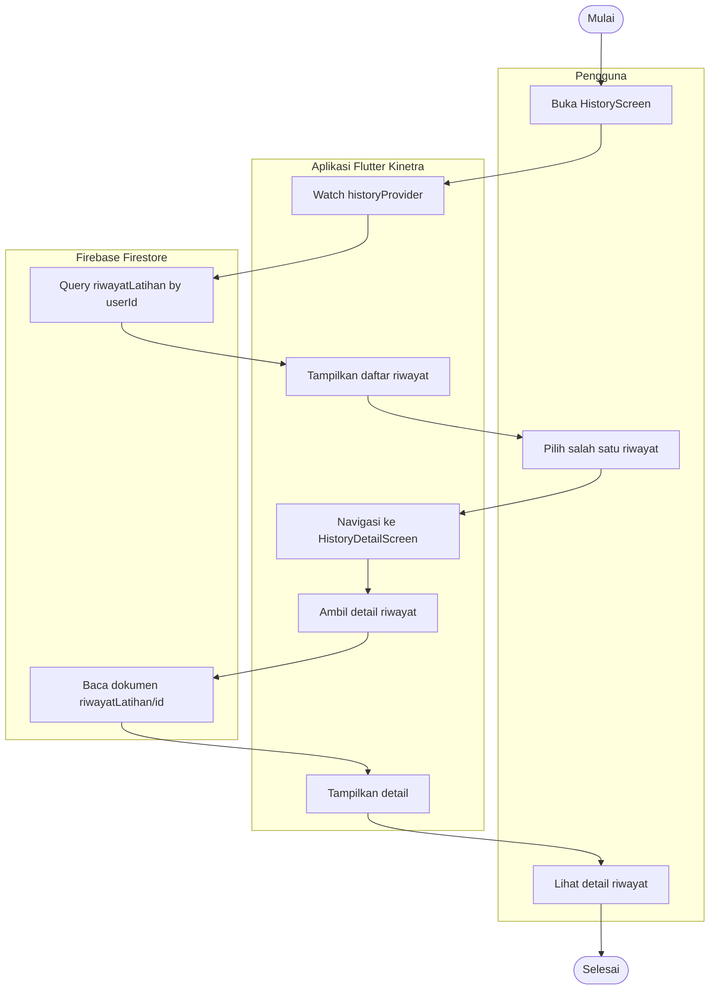
```mermaid
flowchart TD
    Start([Mulai])
    subgraph User["Pengguna"]
        OpenHistory[Buka HistoryScreen]
        SelectHistory[Pilih salah satu riwayat]
        ViewDetail[Lihat detail riwayat]
    end
    subgraph App["Aplikasi Flutter Kinetra"]
        WatchHistory[Watch historyProvider]
        RenderHistory[Tampilkan daftar riwayat]
        NavigateDetail[Navigasi ke HistoryDetailScreen]
        LoadHistoryDetail[Ambil detail riwayat]
        RenderDetail[Tampilkan detail]
    end
    subgraph DB["Firebase Firestore"]
        QueryHistory[Query riwayatLatihan by userId]
        ReadHistoryDoc[Baca dokumen riwayatLatihan/id]
    end

    Start --> OpenHistory --> WatchHistory --> QueryHistory --> RenderHistory --> SelectHistory --> NavigateDetail --> LoadHistoryDetail --> ReadHistoryDoc --> RenderDetail --> ViewDetail --> End([Selesai])
```

### 2.12 Activity Diagram - Melihat Profil

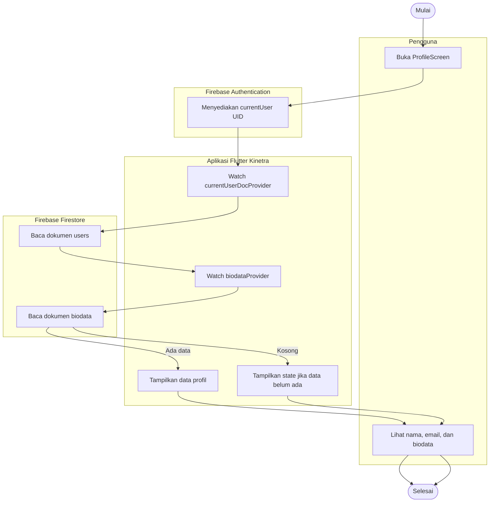
```mermaid
flowchart TD
    Start([Mulai])
    subgraph User["Pengguna"]
        OpenProfile[Buka ProfileScreen]
        ViewProfile[Lihat nama, email, dan biodata]
    end
    subgraph App["Aplikasi Flutter Kinetra"]
        WatchCurrentUser[Watch currentUserDocProvider]
        WatchBiodata[Watch biodataProvider]
        RenderProfile[Tampilkan data profil]
        ShowEmptyState[Tampilkan state jika data belum ada]
    end
    subgraph Auth["Firebase Authentication"]
        ProvideCurrentUser[Menyediakan currentUser UID]
    end
    subgraph DB["Firebase Firestore"]
        ReadUser[Baca dokumen users]
        ReadBiodata[Baca dokumen biodata]
    end

    Start --> OpenProfile --> ProvideCurrentUser --> WatchCurrentUser --> ReadUser --> WatchBiodata --> ReadBiodata
    ReadBiodata -->|Ada data| RenderProfile --> ViewProfile --> End([Selesai])
    ReadBiodata -->|Kosong| ShowEmptyState --> ViewProfile --> End
```

## 3. Class Diagram

Class diagram ini menampilkan entity domain, repository, model Firestore, logic penghitung repetisi, service kamera/ML Kit, serta hubungan class aplikasi dengan teknologi eksternal.

```mermaid
classDiagram
    direction LR

    class UserEntity {
        +String userId
        +String nama
        +String email
        +bool isBiodataCompleted
    }

    class BiodataEntity {
        +String biodataId
        +String userId
        +String jenisKelamin
        +int usia
        +TargetLatihan targetLatihan
        +DateTime updatedAt
    }

    class LatihanEntity {
        +String latihanId
        +String namaLatihan
        +String kategoriLatihan
        +String deskripsi
        +int targetRepetisi
        +int targetDurasi
        +String targetLatihan
        +bool isActive
    }

    class RiwayatEntity {
        +String riwayatId
        +String userId
        +String sesiId
        +DateTime tanggalLatihan
        +String namaLatihan
        +int hasilRepetisi
        +int durasiLatihan
        +double? kaloriEstimasi
        +String? feedbackAkhir
    }

    class WorkoutSession {
        +String sesiId
        +String latihanId
        +String namaLatihan
        +int repetitions
        +int durationSeconds
        +String feedbackAkhir
        +double kaloriEstimasi
    }

    class TargetLatihan {
        <<enumeration>>
        kebugaran
        massaOtot
        kelincahan
    }

    class AuthRepository {
        <<interface>>
        +authStateChanges()
        +currentUser
        +signIn(email, password)
        +signUp(nama, email, password)
        +signOut()
    }

    class UserRepository {
        <<interface>>
        +watchUser(userId)
        +getUser(userId)
    }

    class BiodataRepository {
        <<interface>>
        +watchBiodata(userId)
        +saveBiodata(userId, jenisKelamin, usia, targetLatihan)
    }

    class LatihanRepository {
        <<interface>>
        +watchAllActive()
        +watchByTarget(targetLatihan)
        +getById(latihanId)
    }

    class RiwayatRepository {
        <<interface>>
        +watchByUser(userId)
        +getById(riwayatId)
        +saveSession(userId, session)
    }

    class AuthRepositoryImpl {
        -FirebaseAuth _auth
        -FirebaseFirestore _firestore
        +authStateChanges()
        +signIn(email, password)
        +signUp(nama, email, password)
        +signOut()
    }

    class UserRepositoryImpl {
        -FirebaseFirestore _firestore
        +watchUser(userId)
        +getUser(userId)
    }

    class BiodataRepositoryImpl {
        -FirebaseFirestore _firestore
        +watchBiodata(userId)
        +saveBiodata(userId, jenisKelamin, usia, targetLatihan)
    }

    class LatihanRepositoryImpl {
        -FirebaseFirestore _firestore
        +watchAllActive()
        +watchByTarget(targetLatihan)
        +getById(latihanId)
    }

    class RiwayatRepositoryImpl {
        -FirebaseFirestore _firestore
        +watchByUser(userId)
        +getById(riwayatId)
        +saveSession(userId, session)
    }

    class UserModel {
        +fromFirestore(doc)
        +toFirestore()
        +toEntity()
    }

    class BiodataModel {
        +fromFirestore(doc)
        +toFirestore()
        +toEntity()
    }

    class LatihanModel {
        +fromFirestore(doc)
        +toEntity()
    }

    class RiwayatModel {
        +fromFirestore(doc)
        +toFirestore()
        +toEntity()
    }

    class DetectionScreen {
        -CameraService _cameraService
        -PoseDetectorService _poseService
        -ExerciseLogic _logic
        +initState()
        +build(context)
        -_beginWorkout()
        -_finishWorkout()
    }

    class CameraService {
        -CameraController _controller
        +initialize(useFrontCamera)
        +startImageStream(onImage)
        +stopImageStream()
        +dispose()
    }

    class PoseDetectorService {
        -PoseDetector _detector
        -bool _isProcessing
        +initialize()
        +processCameraImage(image, rotation, isFrontCamera)
        +computeRotation(sensorOrientation, deviceOrientation, isFrontCamera)
        +dispose()
    }

    class ExerciseLogic {
        <<interface>>
        +int repCount
        +String feedback
        +String status
        +bool isPoseValid
        +processPose(pose)
        +reset()
    }

    class ExerciseLogicFactory {
        +fromLatihanId(latihanId)
    }

    class PushUpLogic
    class SquatLogic
    class JumpingJackLogic
    class HighKneeLogic
    class MountainClimberLogic
    class SitUpLogic
    class LungeLogic
    class SkaterJumpLogic
    class BurpeeLogic

    class FirebaseAuth {
        <<external>>
        +authStateChanges()
        +signInWithEmailAndPassword()
        +createUserWithEmailAndPassword()
        +signOut()
    }

    class FirebaseFirestore {
        <<external>>
        +collection(name)
    }

    class PoseDetector {
        <<external ML Kit>>
        +processImage(inputImage)
        +close()
    }

    class CameraController {
        <<external camera plugin>>
        +initialize()
        +startImageStream()
        +stopImageStream()
    }

    UserEntity "1" --> "0..1" BiodataEntity : memiliki
    UserEntity "1" --> "0..*" RiwayatEntity : memiliki
    LatihanEntity "1" --> "0..*" WorkoutSession : dipilih pada
    WorkoutSession "1" --> "0..1" RiwayatEntity : disimpan sebagai
    BiodataEntity --> TargetLatihan

    AuthRepositoryImpl ..|> AuthRepository
    UserRepositoryImpl ..|> UserRepository
    BiodataRepositoryImpl ..|> BiodataRepository
    LatihanRepositoryImpl ..|> LatihanRepository
    RiwayatRepositoryImpl ..|> RiwayatRepository

    UserModel ..> UserEntity : toEntity
    BiodataModel ..> BiodataEntity : toEntity
    LatihanModel ..> LatihanEntity : toEntity
    RiwayatModel ..> RiwayatEntity : toEntity

    AuthRepositoryImpl --> FirebaseAuth
    AuthRepositoryImpl --> FirebaseFirestore
    UserRepositoryImpl --> FirebaseFirestore
    BiodataRepositoryImpl --> FirebaseFirestore
    LatihanRepositoryImpl --> FirebaseFirestore
    RiwayatRepositoryImpl --> FirebaseFirestore

    DetectionScreen --> CameraService
    DetectionScreen --> PoseDetectorService
    DetectionScreen --> ExerciseLogic
    DetectionScreen --> WorkoutSession
    CameraService --> CameraController
    PoseDetectorService --> PoseDetector
    ExerciseLogicFactory ..> ExerciseLogic : membuat

    PushUpLogic ..|> ExerciseLogic
    SquatLogic ..|> ExerciseLogic
    JumpingJackLogic ..|> ExerciseLogic
    HighKneeLogic ..|> ExerciseLogic
    MountainClimberLogic ..|> ExerciseLogic
    SitUpLogic ..|> ExerciseLogic
    LungeLogic ..|> ExerciseLogic
    SkaterJumpLogic ..|> ExerciseLogic
    BurpeeLogic ..|> ExerciseLogic
```

## 4. Sequence Diagram

Sequence diagram berikut juga dipecah per use case. Setiap diagram menampilkan interaksi antar aktor/objek utama, termasuk Firebase Authentication, Firebase Firestore, dan Google ML Kit ketika terlibat dalam use case tersebut.

### 4.1 Sequence Diagram - Registrasi Akun

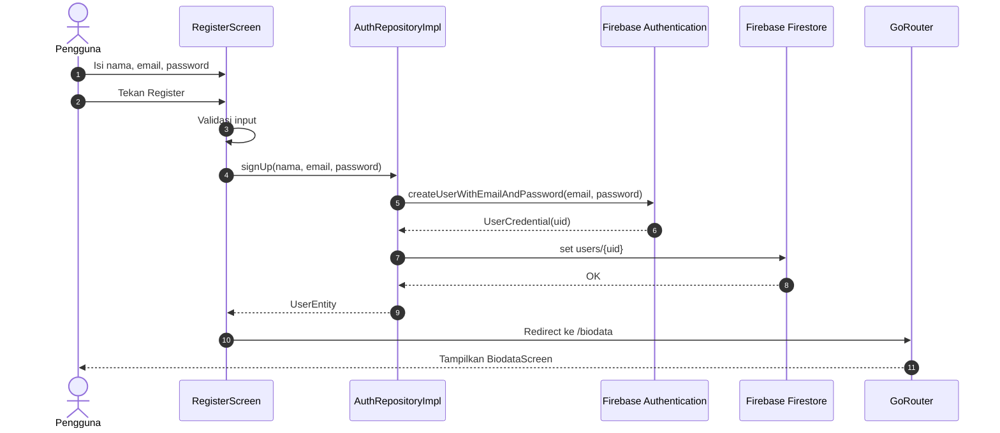
```mermaid
sequenceDiagram
    autonumber
    actor User as Pengguna
    participant Register as RegisterScreen
    participant AuthRepo as AuthRepositoryImpl
    participant FirebaseAuth as Firebase Authentication
    participant Firestore as Firebase Firestore
    participant Router as GoRouter

    User->>Register: Isi nama, email, password
    User->>Register: Tekan Register
    Register->>Register: Validasi input
    Register->>AuthRepo: signUp(nama, email, password)
    AuthRepo->>FirebaseAuth: createUserWithEmailAndPassword(email, password)
    FirebaseAuth-->>AuthRepo: UserCredential(uid)
    AuthRepo->>Firestore: set users/{uid}
    Firestore-->>AuthRepo: OK
    AuthRepo-->>Register: UserEntity
    Register->>Router: Redirect ke /biodata
    Router-->>User: Tampilkan BiodataScreen
```

### 4.2 Sequence Diagram - Login

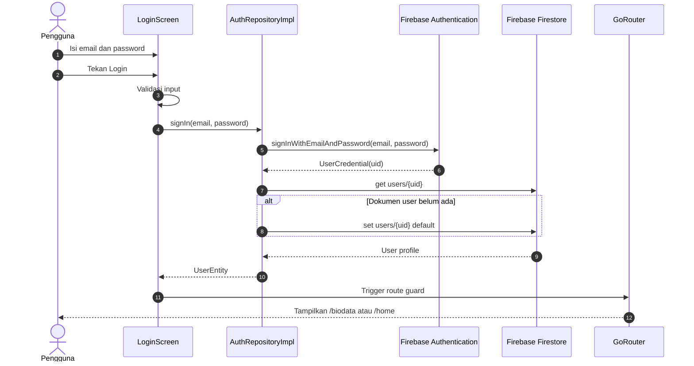
```mermaid
sequenceDiagram
    autonumber
    actor User as Pengguna
    participant Login as LoginScreen
    participant AuthRepo as AuthRepositoryImpl
    participant FirebaseAuth as Firebase Authentication
    participant Firestore as Firebase Firestore
    participant Router as GoRouter

    User->>Login: Isi email dan password
    User->>Login: Tekan Login
    Login->>Login: Validasi input
    Login->>AuthRepo: signIn(email, password)
    AuthRepo->>FirebaseAuth: signInWithEmailAndPassword(email, password)
    FirebaseAuth-->>AuthRepo: UserCredential(uid)
    AuthRepo->>Firestore: get users/{uid}
    alt Dokumen user belum ada
        AuthRepo->>Firestore: set users/{uid} default
    end
    Firestore-->>AuthRepo: User profile
    AuthRepo-->>Login: UserEntity
    Login->>Router: Trigger route guard
    Router-->>User: Tampilkan /biodata atau /home
```

### 4.3 Sequence Diagram - Logout

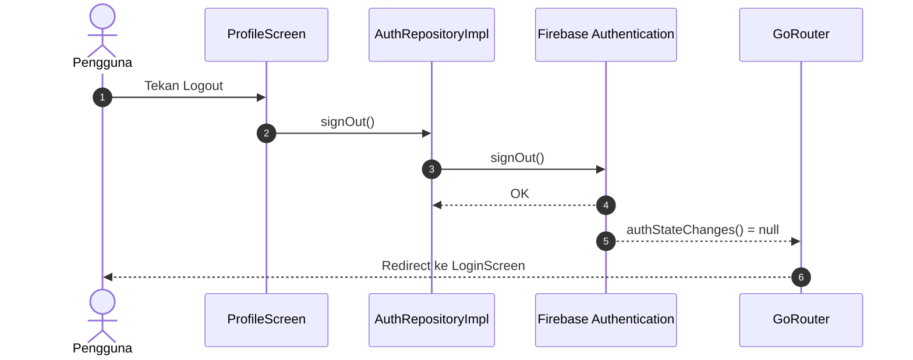
```mermaid
sequenceDiagram
    autonumber
    actor User as Pengguna
    participant Profile as ProfileScreen
    participant AuthRepo as AuthRepositoryImpl
    participant FirebaseAuth as Firebase Authentication
    participant Router as GoRouter

    User->>Profile: Tekan Logout
    Profile->>AuthRepo: signOut()
    AuthRepo->>FirebaseAuth: signOut()
    FirebaseAuth-->>AuthRepo: OK
    FirebaseAuth-->>Router: authStateChanges() = null
    Router-->>User: Redirect ke LoginScreen
```

### 4.4 Sequence Diagram - Mengisi Biodata

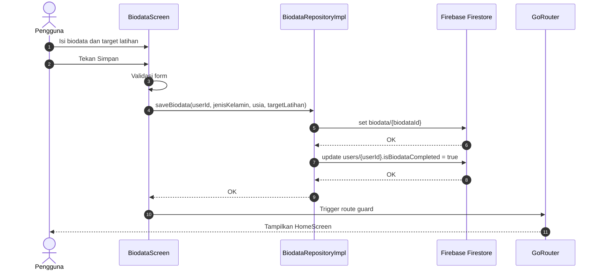
```mermaid
sequenceDiagram
    autonumber
    actor User as Pengguna
    participant Biodata as BiodataScreen
    participant BiodataRepo as BiodataRepositoryImpl
    participant Firestore as Firebase Firestore
    participant Router as GoRouter

    User->>Biodata: Isi biodata dan target latihan
    User->>Biodata: Tekan Simpan
    Biodata->>Biodata: Validasi form
    Biodata->>BiodataRepo: saveBiodata(userId, jenisKelamin, usia, targetLatihan)
    BiodataRepo->>Firestore: set biodata/{biodataId}
    Firestore-->>BiodataRepo: OK
    BiodataRepo->>Firestore: update users/{userId}.isBiodataCompleted = true
    Firestore-->>BiodataRepo: OK
    BiodataRepo-->>Biodata: OK
    Biodata->>Router: Trigger route guard
    Router-->>User: Tampilkan HomeScreen
```

### 4.5 Sequence Diagram - Melihat Rekomendasi Latihan

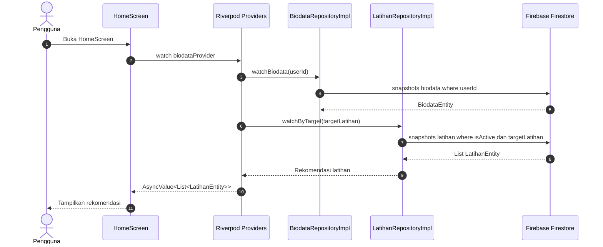
```mermaid
sequenceDiagram
    autonumber
    actor User as Pengguna
    participant Home as HomeScreen
    participant Providers as Riverpod Providers
    participant BiodataRepo as BiodataRepositoryImpl
    participant LatihanRepo as LatihanRepositoryImpl
    participant Firestore as Firebase Firestore

    User->>Home: Buka HomeScreen
    Home->>Providers: watch biodataProvider
    Providers->>BiodataRepo: watchBiodata(userId)
    BiodataRepo->>Firestore: snapshots biodata where userId
    Firestore-->>BiodataRepo: BiodataEntity
    Providers->>LatihanRepo: watchByTarget(targetLatihan)
    LatihanRepo->>Firestore: snapshots latihan where isActive dan targetLatihan
    Firestore-->>LatihanRepo: List LatihanEntity
    LatihanRepo-->>Providers: Rekomendasi latihan
    Providers-->>Home: AsyncValue<List<LatihanEntity>>
    Home-->>User: Tampilkan rekomendasi
```

### 4.6 Sequence Diagram - Melihat Daftar Latihan

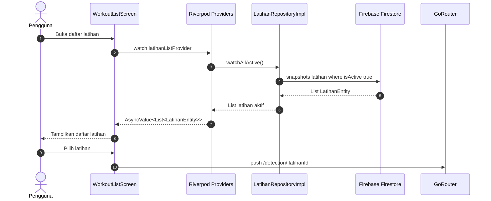
```mermaid
sequenceDiagram
    autonumber
    actor User as Pengguna
    participant WorkoutList as WorkoutListScreen
    participant Providers as Riverpod Providers
    participant LatihanRepo as LatihanRepositoryImpl
    participant Firestore as Firebase Firestore
    participant Router as GoRouter

    User->>WorkoutList: Buka daftar latihan
    WorkoutList->>Providers: watch latihanListProvider
    Providers->>LatihanRepo: watchAllActive()
    LatihanRepo->>Firestore: snapshots latihan where isActive true
    Firestore-->>LatihanRepo: List LatihanEntity
    LatihanRepo-->>Providers: List latihan aktif
    Providers-->>WorkoutList: AsyncValue<List<LatihanEntity>>
    WorkoutList-->>User: Tampilkan daftar latihan
    User->>WorkoutList: Pilih latihan
    WorkoutList->>Router: push /detection/:latihanId
```

### 4.7 Sequence Diagram - Memulai Sesi Workout

```mermaid
sequenceDiagram
    autonumber
    actor User as Pengguna
    participant Detection as DetectionScreen
    participant LatihanRepo as LatihanRepositoryImpl
    participant Firestore as Firebase Firestore
    participant Camera as CameraService
    participant MLKit as Google ML Kit PoseDetector
    participant Factory as ExerciseLogicFactory

    User->>Detection: Masuk ke halaman deteksi
    Detection->>LatihanRepo: getById(latihanId)
    LatihanRepo->>Firestore: query latihan
    Firestore-->>LatihanRepo: LatihanEntity
    LatihanRepo-->>Detection: Detail latihan
    Detection->>Detection: Hitung target personal dari biodata
    Detection->>Factory: fromLatihanId(latihanId)
    Factory-->>Detection: ExerciseLogic
    Detection->>User: Minta izin kamera
    User-->>Detection: Izin diberikan
    Detection->>Camera: initialize(useFrontCamera: true)
    Camera-->>Detection: Kamera siap
    Detection->>MLKit: initialize PoseDetector stream mode
    MLKit-->>Detection: PoseDetector siap
    Detection-->>User: Countdown 5 detik
    Detection->>Camera: startImageStream(callback)
```

### 4.8 Sequence Diagram - Mendeteksi Pose Real-time

```mermaid
sequenceDiagram
    autonumber
    actor User as Pengguna
    participant Camera as CameraService
    participant Detection as DetectionScreen
    participant PoseService as PoseDetectorService
    participant MLKit as Google ML Kit PoseDetector
    participant Overlay as PosePainter

    User->>Camera: Bergerak di depan kamera
    Camera-->>Detection: CameraImage frame
    Detection->>PoseService: computeRotation(...)
    Detection->>PoseService: processCameraImage(image, rotation, isFrontCamera)
    PoseService->>PoseService: Convert CameraImage ke InputImage
    PoseService->>MLKit: processImage(inputImage)
    MLKit-->>PoseService: List<Pose>
    PoseService-->>Detection: Pose?
    Detection->>Overlay: Update pose dan validasi
    Overlay-->>User: Render skeleton overlay
```

### 4.9 Sequence Diagram - Menghitung Repetisi

```mermaid
sequenceDiagram
    autonumber
    participant MLKit as Google ML Kit PoseDetector
    participant Detection as DetectionScreen
    participant Logic as ExerciseLogic
    participant PoseMath as PoseMath
    actor User as Pengguna

    MLKit-->>Detection: Pose hasil deteksi
    Detection->>Logic: processPose(pose)
    Logic->>PoseMath: isVisible(landmark)
    PoseMath-->>Logic: Status visibilitas
    alt Pose valid
        Logic->>PoseMath: angle(titikA, titikB, titikC)
        PoseMath-->>Logic: Sudut gerakan
        Logic->>Logic: Deteksi fase gerakan
        Logic->>Logic: Tambah repCount bila repetisi valid
        Logic-->>Detection: repCount, feedback, isPoseValid
    else Pose tidak valid
        Logic-->>Detection: feedback pose tidak terdeteksi
    end
    Detection-->>User: Tampilkan repetisi dan feedback
```

### 4.10 Sequence Diagram - Menyimpan Riwayat Latihan

```mermaid
sequenceDiagram
    autonumber
    actor User as Pengguna
    participant Detection as DetectionScreen
    participant Camera as CameraService
    participant Calories as CalorieEstimator
    participant RiwayatRepo as RiwayatRepositoryImpl
    participant Firestore as Firebase Firestore
    participant Router as GoRouter
    participant Result as ResultScreen

    User->>Detection: Tekan selesai
    Detection->>Camera: stopImageStream()
    Camera-->>Detection: Stream berhenti
    Detection->>Detection: Stop stopwatch
    Detection->>Calories: estimate(latihanId, reps, duration)
    Calories-->>Detection: kaloriEstimasi
    Detection->>Detection: Buat WorkoutSession
    Detection->>RiwayatRepo: saveSession(userId, session)
    RiwayatRepo->>Firestore: set riwayatLatihan/{riwayatId}
    Firestore-->>RiwayatRepo: OK
    RiwayatRepo-->>Detection: OK
    Detection->>Router: pushReplacement(/result, session)
    Router->>Result: Tampilkan hasil
    Result-->>User: Repetisi, durasi, kalori, feedback
```

### 4.11 Sequence Diagram - Melihat Riwayat Latihan

```mermaid
sequenceDiagram
    autonumber
    actor User as Pengguna
    participant History as HistoryScreen
    participant Providers as Riverpod Providers
    participant RiwayatRepo as RiwayatRepositoryImpl
    participant Firestore as Firebase Firestore
    participant Router as GoRouter
    participant Detail as HistoryDetailScreen

    User->>History: Buka HistoryScreen
    History->>Providers: watch historyProvider
    Providers->>RiwayatRepo: watchByUser(userId)
    RiwayatRepo->>Firestore: snapshots riwayatLatihan where userId
    Firestore-->>RiwayatRepo: List RiwayatEntity
    RiwayatRepo-->>Providers: List riwayat terurut
    Providers-->>History: AsyncValue<List<RiwayatEntity>>
    History-->>User: Tampilkan daftar riwayat
    User->>History: Pilih riwayat
    History->>Router: push /history/:id
    Router->>Detail: Buat HistoryDetailScreen(id)
    Detail->>RiwayatRepo: getById(riwayatId)
    RiwayatRepo->>Firestore: get riwayatLatihan/{id}
    Firestore-->>RiwayatRepo: RiwayatEntity
    RiwayatRepo-->>Detail: Detail riwayat
    Detail-->>User: Tampilkan detail
```

### 4.12 Sequence Diagram - Melihat Profil

```mermaid
sequenceDiagram
    autonumber
    actor User as Pengguna
    participant Profile as ProfileScreen
    participant FirebaseAuth as Firebase Authentication
    participant Providers as Riverpod Providers
    participant UserRepo as UserRepositoryImpl
    participant BiodataRepo as BiodataRepositoryImpl
    participant Firestore as Firebase Firestore

    User->>Profile: Buka ProfileScreen
    Profile->>FirebaseAuth: currentUser.uid
    FirebaseAuth-->>Profile: UID pengguna
    Profile->>Providers: watch currentUserDocProvider
    Providers->>UserRepo: watchUser(uid)
    UserRepo->>Firestore: snapshots users/{uid}
    Firestore-->>UserRepo: UserEntity
    Profile->>Providers: watch biodataProvider
    Providers->>BiodataRepo: watchBiodata(uid)
    BiodataRepo->>Firestore: snapshots biodata where userId
    Firestore-->>BiodataRepo: BiodataEntity?
    Providers-->>Profile: Data profil dan biodata
    Profile-->>User: Tampilkan profil
```

## Catatan Teknologi Eksternal

| Teknologi | Peran dalam sistem |
| --- | --- |
| Firebase Authentication | Mengelola registrasi, login, logout, dan status autentikasi pengguna. |
| Firebase Firestore | Menyimpan profil pengguna, biodata, katalog latihan, dan riwayat latihan. |
| Google ML Kit Pose Detection | Mendeteksi landmark tubuh dari frame kamera untuk dihitung oleh `ExerciseLogic`. |
