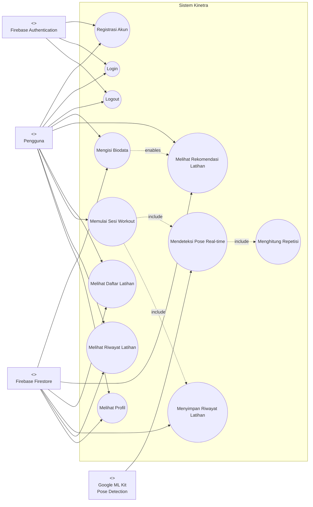
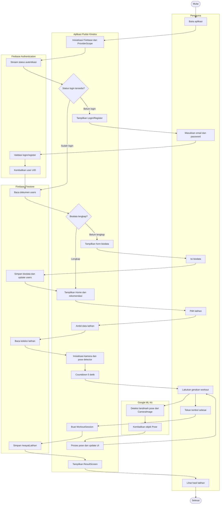
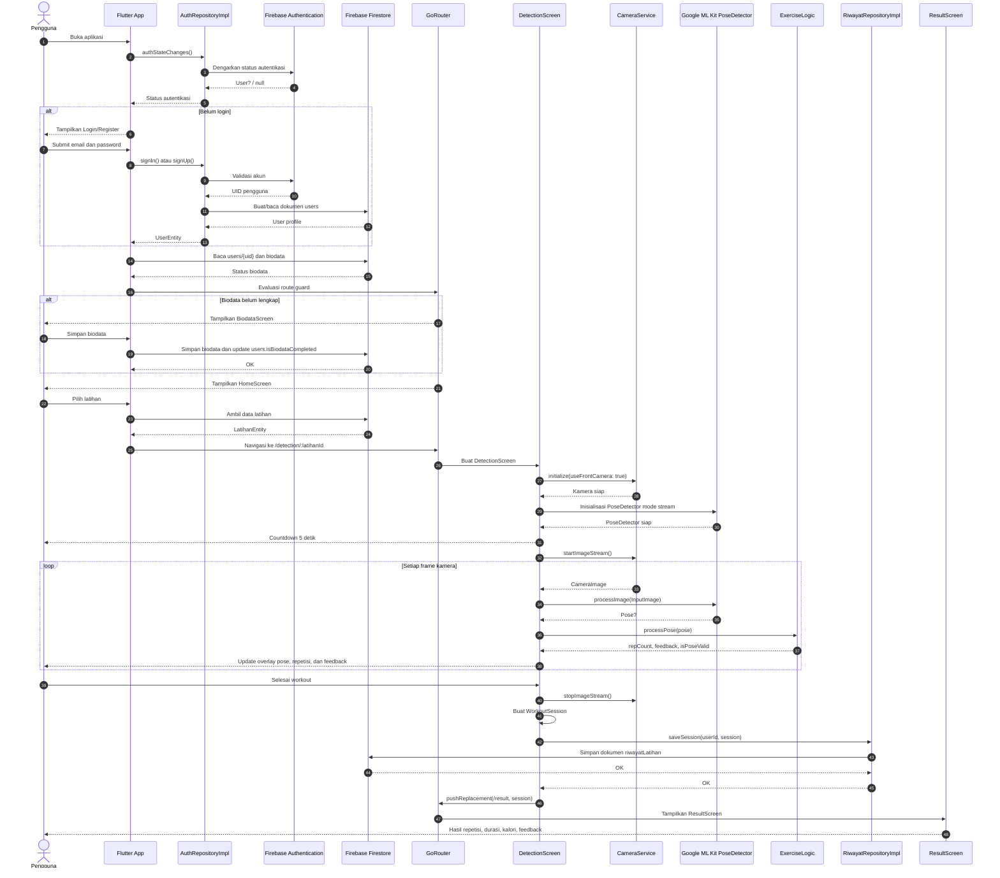

# Diagram UML Kinetra

Dokumen ini berisi empat diagram UML utama untuk proyek Kinetra:

1. Use Case Diagram
2. Activity Diagram
3. Class Diagram
4. Sequence Diagram

Diagram dibuat dengan Mermaid agar dapat dirender langsung di Markdown. Selain pengguna aplikasi, diagram juga melibatkan teknologi eksternal yang digunakan proyek: Google ML Kit, Firebase Authentication, dan Firebase Firestore.

## 1. Use Case Diagram

## 2. Activity Diagram

Activity diagram berikut menggambarkan alur utama aplikasi dari autentikasi sampai sesi workout selesai. Swimlane dibuat sebagai subgraph untuk menunjukkan tanggung jawab antara pengguna, aplikasi Flutter, Firebase Authentication, Firebase Firestore, dan Google ML Kit.

## 3. Class Diagram

Class diagram ini menampilkan entity domain, repository, model Firestore, logic penghitung repetisi, service kamera/ML Kit, serta hubungan class aplikasi dengan teknologi eksternal.

```mermaid
classDiagram
    direction LR

    class UserEntity {
        +String userId
        +String nama
        +String email
        +bool isBiodataCompleted
    }

    class BiodataEntity {
        +String biodataId
        +String userId
        +String jenisKelamin
        +int usia
        +TargetLatihan targetLatihan
        +DateTime updatedAt
    }

    class LatihanEntity {
        +String latihanId
        +String namaLatihan
        +String kategoriLatihan
        +String deskripsi
        +int targetRepetisi
        +int targetDurasi
        +String targetLatihan
        +bool isActive
    }

    class RiwayatEntity {
        +String riwayatId
        +String userId
        +String sesiId
        +DateTime tanggalLatihan
        +String namaLatihan
        +int hasilRepetisi
        +int durasiLatihan
        +double? kaloriEstimasi
        +String? feedbackAkhir
    }

    class WorkoutSession {
        +String sesiId
        +String latihanId
        +String namaLatihan
        +int repetitions
        +int durationSeconds
        +String feedbackAkhir
        +double kaloriEstimasi
    }

    class TargetLatihan {
        <<enumeration>>
        kebugaran
        massaOtot
        kelincahan
    }

    class AuthRepository {
        <<interface>>
        +authStateChanges()
        +currentUser
        +signIn(email, password)
        +signUp(nama, email, password)
        +signOut()
    }

    class UserRepository {
        <<interface>>
        +watchUser(userId)
        +getUser(userId)
    }

    class BiodataRepository {
        <<interface>>
        +watchBiodata(userId)
        +saveBiodata(userId, jenisKelamin, usia, targetLatihan)
    }

    class LatihanRepository {
        <<interface>>
        +watchAllActive()
        +watchByTarget(targetLatihan)
        +getById(latihanId)
    }

    class RiwayatRepository {
        <<interface>>
        +watchByUser(userId)
        +getById(riwayatId)
        +saveSession(userId, session)
    }

    class AuthRepositoryImpl {
        -FirebaseAuth _auth
        -FirebaseFirestore _firestore
        +authStateChanges()
        +signIn(email, password)
        +signUp(nama, email, password)
        +signOut()
    }

    class UserRepositoryImpl {
        -FirebaseFirestore _firestore
        +watchUser(userId)
        +getUser(userId)
    }

    class BiodataRepositoryImpl {
        -FirebaseFirestore _firestore
        +watchBiodata(userId)
        +saveBiodata(userId, jenisKelamin, usia, targetLatihan)
    }

    class LatihanRepositoryImpl {
        -FirebaseFirestore _firestore
        +watchAllActive()
        +watchByTarget(targetLatihan)
        +getById(latihanId)
    }

    class RiwayatRepositoryImpl {
        -FirebaseFirestore _firestore
        +watchByUser(userId)
        +getById(riwayatId)
        +saveSession(userId, session)
    }

    class UserModel {
        +fromFirestore(doc)
        +toFirestore()
        +toEntity()
    }

    class BiodataModel {
        +fromFirestore(doc)
        +toFirestore()
        +toEntity()
    }

    class LatihanModel {
        +fromFirestore(doc)
        +toEntity()
    }

    class RiwayatModel {
        +fromFirestore(doc)
        +toFirestore()
        +toEntity()
    }

    class DetectionScreen {
        -CameraService _cameraService
        -PoseDetectorService _poseService
        -ExerciseLogic _logic
        +initState()
        +build(context)
        -_beginWorkout()
        -_finishWorkout()
    }

    class CameraService {
        -CameraController _controller
        +initialize(useFrontCamera)
        +startImageStream(onImage)
        +stopImageStream()
        +dispose()
    }

    class PoseDetectorService {
        -PoseDetector _detector
        -bool _isProcessing
        +initialize()
        +processCameraImage(image, rotation, isFrontCamera)
        +computeRotation(sensorOrientation, deviceOrientation, isFrontCamera)
        +dispose()
    }

    class ExerciseLogic {
        <<interface>>
        +int repCount
        +String feedback
        +String status
        +bool isPoseValid
        +processPose(pose)
        +reset()
    }

    class ExerciseLogicFactory {
        +fromLatihanId(latihanId)
    }

    class PushUpLogic
    class SquatLogic
    class JumpingJackLogic
    class HighKneeLogic
    class MountainClimberLogic
    class SitUpLogic
    class LungeLogic
    class SkaterJumpLogic
    class BurpeeLogic

    class FirebaseAuth {
        <<external>>
        +authStateChanges()
        +signInWithEmailAndPassword()
        +createUserWithEmailAndPassword()
        +signOut()
    }

    class FirebaseFirestore {
        <<external>>
        +collection(name)
    }

    class PoseDetector {
        <<external ML Kit>>
        +processImage(inputImage)
        +close()
    }

    class CameraController {
        <<external camera plugin>>
        +initialize()
        +startImageStream()
        +stopImageStream()
    }

    UserEntity "1" --> "0..1" BiodataEntity : memiliki
    UserEntity "1" --> "0..*" RiwayatEntity : memiliki
    LatihanEntity "1" --> "0..*" WorkoutSession : dipilih pada
    WorkoutSession "1" --> "0..1" RiwayatEntity : disimpan sebagai
    BiodataEntity --> TargetLatihan

    AuthRepositoryImpl ..|> AuthRepository
    UserRepositoryImpl ..|> UserRepository
    BiodataRepositoryImpl ..|> BiodataRepository
    LatihanRepositoryImpl ..|> LatihanRepository
    RiwayatRepositoryImpl ..|> RiwayatRepository

    UserModel ..> UserEntity : toEntity
    BiodataModel ..> BiodataEntity : toEntity
    LatihanModel ..> LatihanEntity : toEntity
    RiwayatModel ..> RiwayatEntity : toEntity

    AuthRepositoryImpl --> FirebaseAuth
    AuthRepositoryImpl --> FirebaseFirestore
    UserRepositoryImpl --> FirebaseFirestore
    BiodataRepositoryImpl --> FirebaseFirestore
    LatihanRepositoryImpl --> FirebaseFirestore
    RiwayatRepositoryImpl --> FirebaseFirestore

    DetectionScreen --> CameraService
    DetectionScreen --> PoseDetectorService
    DetectionScreen --> ExerciseLogic
    DetectionScreen --> WorkoutSession
    CameraService --> CameraController
    PoseDetectorService --> PoseDetector
    ExerciseLogicFactory ..> ExerciseLogic : membuat

    PushUpLogic ..|> ExerciseLogic
    SquatLogic ..|> ExerciseLogic
    JumpingJackLogic ..|> ExerciseLogic
    HighKneeLogic ..|> ExerciseLogic
    MountainClimberLogic ..|> ExerciseLogic
    SitUpLogic ..|> ExerciseLogic
    LungeLogic ..|> ExerciseLogic
    SkaterJumpLogic ..|> ExerciseLogic
    BurpeeLogic ..|> ExerciseLogic
```

## 4. Sequence Diagram

Sequence diagram berikut menggambarkan alur lengkap dari pengguna login, aplikasi membaca data dari Firebase, pengguna menjalankan deteksi pose dengan ML Kit, lalu hasil workout disimpan ke Firestore.

## Catatan Teknologi Eksternal

| Teknologi | Peran dalam sistem |
| --- | --- |
| Firebase Authentication | Mengelola registrasi, login, logout, dan status autentikasi pengguna. |
| Firebase Firestore | Menyimpan profil pengguna, biodata, katalog latihan, dan riwayat latihan. |
| Google ML Kit Pose Detection | Mendeteksi landmark tubuh dari frame kamera untuk dihitung oleh `ExerciseLogic`. |
