# Diagram UML Kinetra

Dokumen ini berisi empat diagram UML utama untuk proyek Kinetra:

1. Use Case Diagram
2. Activity Diagram
3. Class Diagram
4. Sequence Diagram

Diagram dibuat dengan Mermaid agar dapat dirender langsung di Markdown. Selain pengguna aplikasi, diagram juga melibatkan teknologi eksternal yang digunakan proyek: Google ML Kit, Firebase Authentication, dan Firebase Firestore.

## 1. Use Case Diagram

Use Case Diagram dibuat ringkas untuk menampilkan fungsi inti sistem. Detail seperti validasi, error handling, fallback data, dan percabangan teknis dijelaskan pada Activity Diagram dan Sequence Diagram.

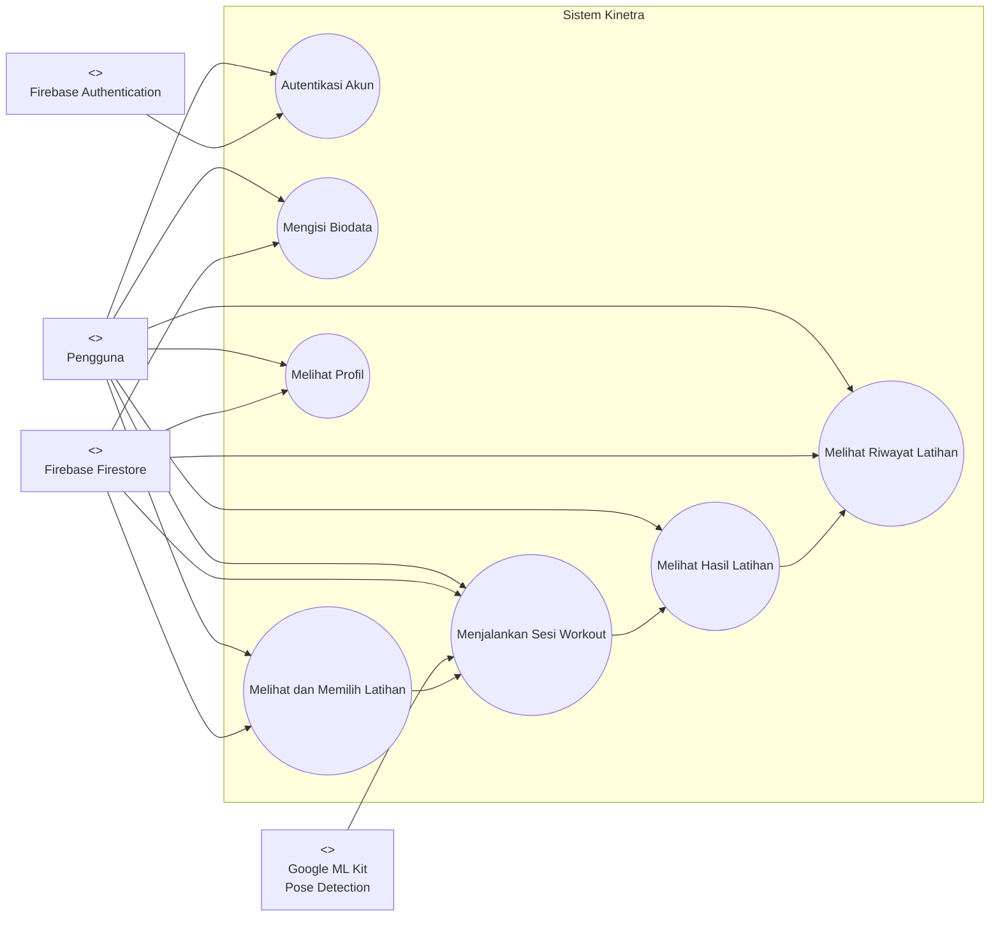
```mermaid
flowchart LR
    Pengguna["<<actor>>\nPengguna"]
    MLKit["<<actor>>\nGoogle ML Kit\nPose Detection"]
    FirebaseAuth["<<actor>>\nFirebase Authentication"]
    Firestore["<<actor>>\nFirebase Firestore"]

    subgraph Sistem["Sistem Kinetra"]
        UCAuth(("Autentikasi Akun"))
        UCBiodata(("Mengisi Biodata"))
        UCWorkoutCatalog(("Melihat dan Memilih Latihan"))
        UCWorkoutSession(("Menjalankan Sesi Workout"))
        UCResult(("Melihat Hasil Latihan"))
        UCHistory(("Melihat Riwayat Latihan"))
        UCProfile(("Melihat Profil"))
    end

    Pengguna --> UCAuth
    Pengguna --> UCBiodata
    Pengguna --> UCWorkoutCatalog
    Pengguna --> UCWorkoutSession
    Pengguna --> UCResult
    Pengguna --> UCHistory
    Pengguna --> UCProfile

    FirebaseAuth --> UCAuth
    Firestore --> UCBiodata
    Firestore --> UCWorkoutCatalog
    Firestore --> UCWorkoutSession
    Firestore --> UCHistory
    Firestore --> UCProfile
    MLKit --> UCWorkoutSession

    UCWorkoutCatalog --> UCWorkoutSession
    UCWorkoutSession --> UCResult
    UCResult --> UCHistory
```

## 2. Activity Diagram

Activity diagram berikut tetap dibuat rinci per alur turunan dari use case inti agar proses sistem mudah ditelusuri. Decision node ditulis dengan bentuk diamond `{...}` untuk memperjelas kondisi berhasil/gagal, data tersedia/tidak tersedia, dan loop proses yang terjadi.

### 2.1 Activity Diagram - Registrasi Akun

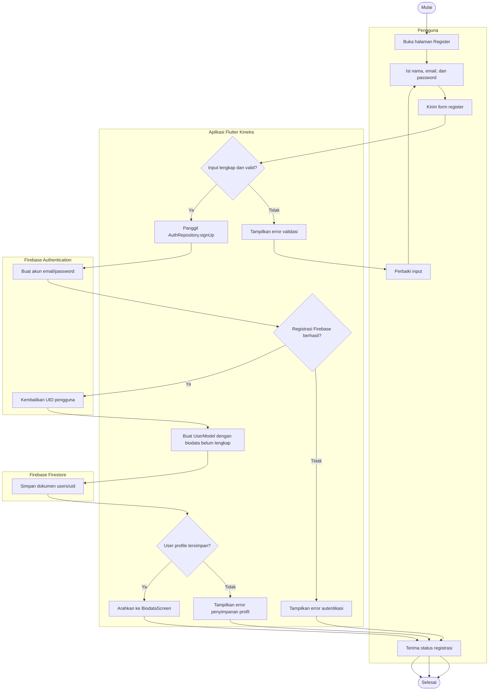
```mermaid
flowchart TD
    Start([Mulai])
    subgraph User["Pengguna"]
        OpenRegister[Buka halaman Register]
        FillRegister[Isi nama, email, dan password]
        SubmitRegister[Kirim form register]
        FixInput[Perbaiki input]
        ReceiveResult[Terima status registrasi]
    end
    subgraph App["Aplikasi Flutter Kinetra"]
        ValidateInput{Input lengkap dan valid?}
        CallSignUp[Panggil AuthRepository.signUp]
        AuthSuccess{Registrasi Firebase berhasil?}
        CreateUserModel[Buat UserModel dengan biodata belum lengkap]
        FirestoreSuccess{User profile tersimpan?}
        RedirectBiodata[Arahkan ke BiodataScreen]
        ShowValidationError[Tampilkan error validasi]
        ShowAuthError[Tampilkan error autentikasi]
        ShowFirestoreError[Tampilkan error penyimpanan profil]
    end
    subgraph Auth["Firebase Authentication"]
        CreateCredential[Buat akun email/password]
        ReturnUid[Kembalikan UID pengguna]
    end
    subgraph DB["Firebase Firestore"]
        SaveUser[Simpan dokumen users/uid]
    end

    Start --> OpenRegister --> FillRegister --> SubmitRegister --> ValidateInput
    ValidateInput -->|Tidak| ShowValidationError --> FixInput --> FillRegister
    ValidateInput -->|Ya| CallSignUp --> CreateCredential --> AuthSuccess
    AuthSuccess -->|Tidak| ShowAuthError --> ReceiveResult --> End([Selesai])
    AuthSuccess -->|Ya| ReturnUid --> CreateUserModel --> SaveUser --> FirestoreSuccess
    FirestoreSuccess -->|Tidak| ShowFirestoreError --> ReceiveResult --> End
    FirestoreSuccess -->|Ya| RedirectBiodata --> ReceiveResult --> End
```

### 2.2 Activity Diagram - Login

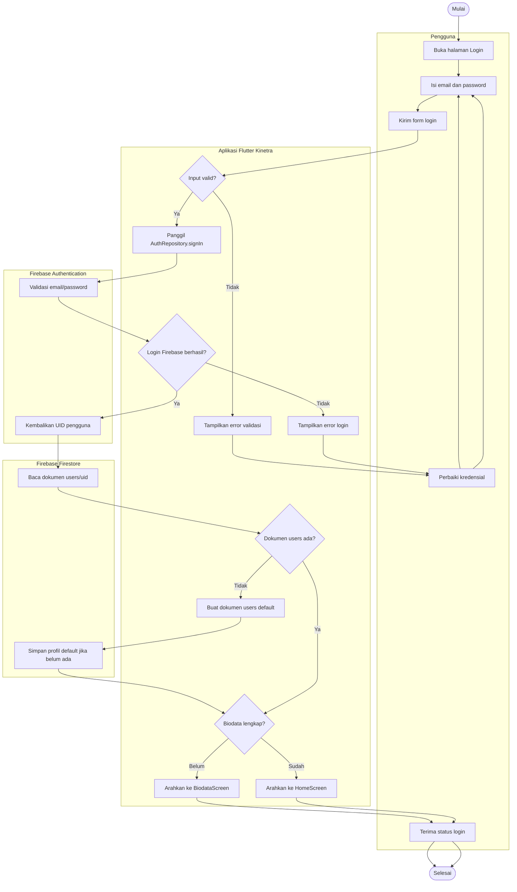
```mermaid
flowchart TD
    Start([Mulai])
    subgraph User["Pengguna"]
        OpenLogin[Buka halaman Login]
        FillLogin[Isi email dan password]
        SubmitLogin[Kirim form login]
        RetryLogin[Perbaiki kredensial]
        ReceiveResult[Terima status login]
    end
    subgraph App["Aplikasi Flutter Kinetra"]
        ValidateInput{Input valid?}
        CallSignIn[Panggil AuthRepository.signIn]
        LoginSuccess{Login Firebase berhasil?}
        UserDocExists{Dokumen users ada?}
        CreateDefaultUser[Buat dokumen users default]
        CheckBiodata{Biodata lengkap?}
        GoBiodata[Arahkan ke BiodataScreen]
        GoHome[Arahkan ke HomeScreen]
        ShowValidationError[Tampilkan error validasi]
        ShowAuthError[Tampilkan error login]
    end
    subgraph Auth["Firebase Authentication"]
        VerifyCredential[Validasi email/password]
        ReturnAuthState[Kembalikan UID pengguna]
    end
    subgraph DB["Firebase Firestore"]
        ReadUser[Baca dokumen users/uid]
        SaveDefaultUser[Simpan profil default jika belum ada]
    end

    Start --> OpenLogin --> FillLogin --> SubmitLogin --> ValidateInput
    ValidateInput -->|Tidak| ShowValidationError --> RetryLogin --> FillLogin
    ValidateInput -->|Ya| CallSignIn --> VerifyCredential --> LoginSuccess
    LoginSuccess -->|Tidak| ShowAuthError --> RetryLogin --> FillLogin
    LoginSuccess -->|Ya| ReturnAuthState --> ReadUser --> UserDocExists
    UserDocExists -->|Tidak| CreateDefaultUser --> SaveDefaultUser --> CheckBiodata
    UserDocExists -->|Ya| CheckBiodata
    CheckBiodata -->|Belum| GoBiodata --> ReceiveResult --> End([Selesai])
    CheckBiodata -->|Sudah| GoHome --> ReceiveResult --> End
```

### 2.3 Activity Diagram - Logout

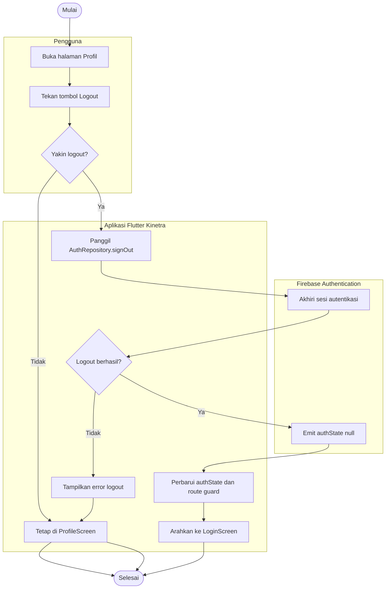
```mermaid
flowchart TD
    Start([Mulai])
    subgraph User["Pengguna"]
        OpenProfile[Buka halaman Profil]
        TapLogout[Tekan tombol Logout]
        ConfirmDecision{Yakin logout?}
    end
    subgraph App["Aplikasi Flutter Kinetra"]
        StayProfile[Tetap di ProfileScreen]
        CallSignOut[Panggil AuthRepository.signOut]
        SignOutSuccess{Logout berhasil?}
        ClearRouteState[Perbarui authState dan route guard]
        GoLogin[Arahkan ke LoginScreen]
        ShowLogoutError[Tampilkan error logout]
    end
    subgraph Auth["Firebase Authentication"]
        EndSession[Akhiri sesi autentikasi]
        EmitNull[Emit authState null]
    end

    Start --> OpenProfile --> TapLogout --> ConfirmDecision
    ConfirmDecision -->|Tidak| StayProfile --> End([Selesai])
    ConfirmDecision -->|Ya| CallSignOut --> EndSession --> SignOutSuccess
    SignOutSuccess -->|Tidak| ShowLogoutError --> StayProfile --> End
    SignOutSuccess -->|Ya| EmitNull --> ClearRouteState --> GoLogin --> End
```

### 2.4 Activity Diagram - Mengisi Biodata

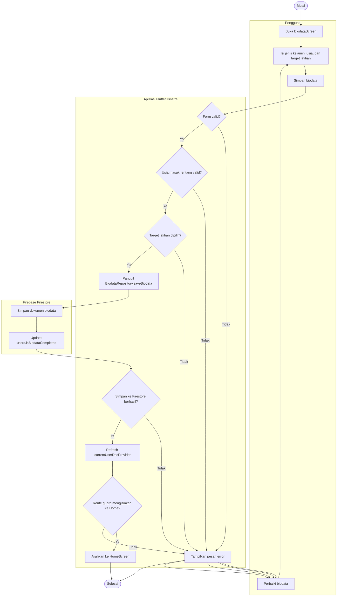
```mermaid
flowchart TD
    Start([Mulai])
    subgraph User["Pengguna"]
        OpenBiodata[Buka BiodataScreen]
        FillBiodata[Isi jenis kelamin, usia, dan target latihan]
        SubmitBiodata[Simpan biodata]
        FixBiodata[Perbaiki biodata]
    end
    subgraph App["Aplikasi Flutter Kinetra"]
        ValidateBiodata{Form valid?}
        AgeValid{Usia masuk rentang valid?}
        TargetSelected{Target latihan dipilih?}
        CallSave[Panggil BiodataRepository.saveBiodata]
        SaveSuccess{Simpan ke Firestore berhasil?}
        RefreshUserDoc[Refresh currentUserDocProvider]
        RouteAllowed{Route guard mengizinkan ke Home?}
        GoHome[Arahkan ke HomeScreen]
        ShowError[Tampilkan pesan error]
    end
    subgraph DB["Firebase Firestore"]
        WriteBiodata[Simpan dokumen biodata]
        UpdateUser[Update users.isBiodataCompleted]
    end

    Start --> OpenBiodata --> FillBiodata --> SubmitBiodata --> ValidateBiodata
    ValidateBiodata -->|Tidak| ShowError --> FixBiodata --> FillBiodata
    ValidateBiodata -->|Ya| AgeValid
    AgeValid -->|Tidak| ShowError --> FixBiodata
    AgeValid -->|Ya| TargetSelected
    TargetSelected -->|Tidak| ShowError --> FixBiodata
    TargetSelected -->|Ya| CallSave --> WriteBiodata --> UpdateUser --> SaveSuccess
    SaveSuccess -->|Tidak| ShowError --> FixBiodata
    SaveSuccess -->|Ya| RefreshUserDoc --> RouteAllowed
    RouteAllowed -->|Ya| GoHome --> End([Selesai])
    RouteAllowed -->|Tidak| ShowError --> End
```

### 2.5 Activity Diagram - Melihat Rekomendasi Latihan

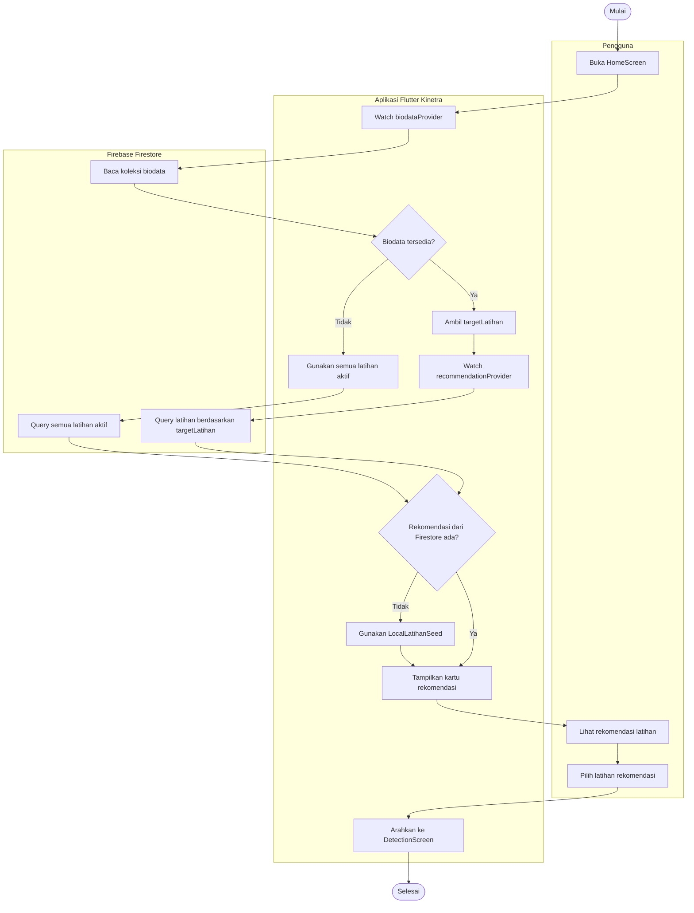
```mermaid
flowchart TD
    Start([Mulai])
    subgraph User["Pengguna"]
        OpenHome[Buka HomeScreen]
        ViewRecommendation[Lihat rekomendasi latihan]
        SelectRecommendation[Pilih latihan rekomendasi]
    end
    subgraph App["Aplikasi Flutter Kinetra"]
        WatchBiodata[Watch biodataProvider]
        BiodataAvailable{Biodata tersedia?}
        UseDefaultTarget[Gunakan semua latihan aktif]
        ReadTarget[Ambil targetLatihan]
        WatchRecommendation[Watch recommendationProvider]
        RecommendationAvailable{Rekomendasi dari Firestore ada?}
        UseFallback[Gunakan LocalLatihanSeed]
        RenderCards[Tampilkan kartu rekomendasi]
        GoDetection[Arahkan ke DetectionScreen]
    end
    subgraph DB["Firebase Firestore"]
        ReadBiodata[Baca koleksi biodata]
        QueryLatihan[Query latihan berdasarkan targetLatihan]
        QueryAllActive[Query semua latihan aktif]
    end

    Start --> OpenHome --> WatchBiodata --> ReadBiodata --> BiodataAvailable
    BiodataAvailable -->|Tidak| UseDefaultTarget --> QueryAllActive --> RecommendationAvailable
    BiodataAvailable -->|Ya| ReadTarget --> WatchRecommendation --> QueryLatihan --> RecommendationAvailable
    RecommendationAvailable -->|Tidak| UseFallback --> RenderCards
    RecommendationAvailable -->|Ya| RenderCards
    RenderCards --> ViewRecommendation --> SelectRecommendation --> GoDetection --> End([Selesai])
```

### 2.6 Activity Diagram - Melihat Daftar Latihan

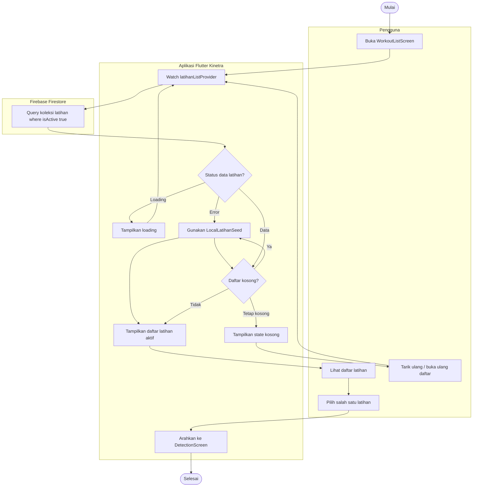
```mermaid
flowchart TD
    Start([Mulai])
    subgraph User["Pengguna"]
        OpenWorkoutList[Buka WorkoutListScreen]
        BrowseList[Lihat daftar latihan]
        SelectWorkout[Pilih salah satu latihan]
        RetryLoad[Tarik ulang / buka ulang daftar]
    end
    subgraph App["Aplikasi Flutter Kinetra"]
        WatchLatihan[Watch latihanListProvider]
        LatihanState{Status data latihan?}
        RenderLoading[Tampilkan loading]
        RenderWorkoutList[Tampilkan daftar latihan aktif]
        EmptyList{Daftar kosong?}
        UseFallback[Gunakan LocalLatihanSeed]
        RenderEmpty[Tampilkan state kosong]
        GoDetection[Arahkan ke DetectionScreen]
    end
    subgraph DB["Firebase Firestore"]
        QueryActiveLatihan[Query koleksi latihan where isActive true]
    end

    Start --> OpenWorkoutList --> WatchLatihan --> QueryActiveLatihan --> LatihanState
    LatihanState -->|Loading| RenderLoading --> WatchLatihan
    LatihanState -->|Error| UseFallback --> EmptyList
    LatihanState -->|Data| EmptyList
    EmptyList -->|Ya| UseFallback --> RenderWorkoutList
    EmptyList -->|Tetap kosong| RenderEmpty --> RetryLoad --> WatchLatihan
    EmptyList -->|Tidak| RenderWorkoutList --> BrowseList --> SelectWorkout --> GoDetection --> End([Selesai])
```

### 2.7 Activity Diagram - Memulai Sesi Workout

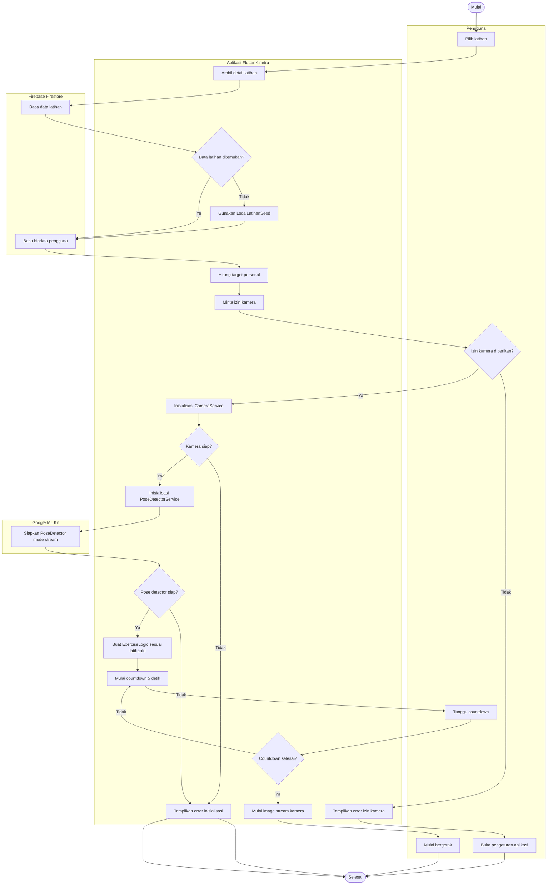
```mermaid
flowchart TD
    Start([Mulai])
    subgraph User["Pengguna"]
        ChooseWorkout[Pilih latihan]
        PermissionDecision{Izin kamera diberikan?}
        OpenSettings[Buka pengaturan aplikasi]
        WaitCountdown[Tunggu countdown]
        StartMoving[Mulai bergerak]
    end
    subgraph App["Aplikasi Flutter Kinetra"]
        LoadLatihan[Ambil detail latihan]
        LatihanFound{Data latihan ditemukan?}
        UseLocalLatihan[Gunakan LocalLatihanSeed]
        CalculateTarget[Hitung target personal]
        RequestCameraPermission[Minta izin kamera]
        InitCamera[Inisialisasi CameraService]
        CameraReady{Kamera siap?}
        InitPoseDetector[Inisialisasi PoseDetectorService]
        DetectorReady{Pose detector siap?}
        CreateLogic[Buat ExerciseLogic sesuai latihanId]
        StartCountdown[Mulai countdown 5 detik]
        CountdownDone{Countdown selesai?}
        StartImageStream[Mulai image stream kamera]
        ShowPermissionError[Tampilkan error izin kamera]
        ShowInitError[Tampilkan error inisialisasi]
    end
    subgraph DB["Firebase Firestore"]
        ReadLatihan[Baca data latihan]
        ReadBiodata[Baca biodata pengguna]
    end
    subgraph MLKit["Google ML Kit"]
        PrepareDetector[Siapkan PoseDetector mode stream]
    end

    Start --> ChooseWorkout --> LoadLatihan --> ReadLatihan --> LatihanFound
    LatihanFound -->|Tidak| UseLocalLatihan --> ReadBiodata
    LatihanFound -->|Ya| ReadBiodata
    ReadBiodata --> CalculateTarget --> RequestCameraPermission --> PermissionDecision
    PermissionDecision -->|Tidak| ShowPermissionError --> OpenSettings --> End([Selesai])
    PermissionDecision -->|Ya| InitCamera --> CameraReady
    CameraReady -->|Tidak| ShowInitError --> End
    CameraReady -->|Ya| InitPoseDetector --> PrepareDetector --> DetectorReady
    DetectorReady -->|Tidak| ShowInitError --> End
    DetectorReady -->|Ya| CreateLogic --> StartCountdown --> WaitCountdown --> CountdownDone
    CountdownDone -->|Tidak| StartCountdown
    CountdownDone -->|Ya| StartImageStream --> StartMoving --> End
```

### 2.8 Activity Diagram - Mendeteksi Pose Real-time

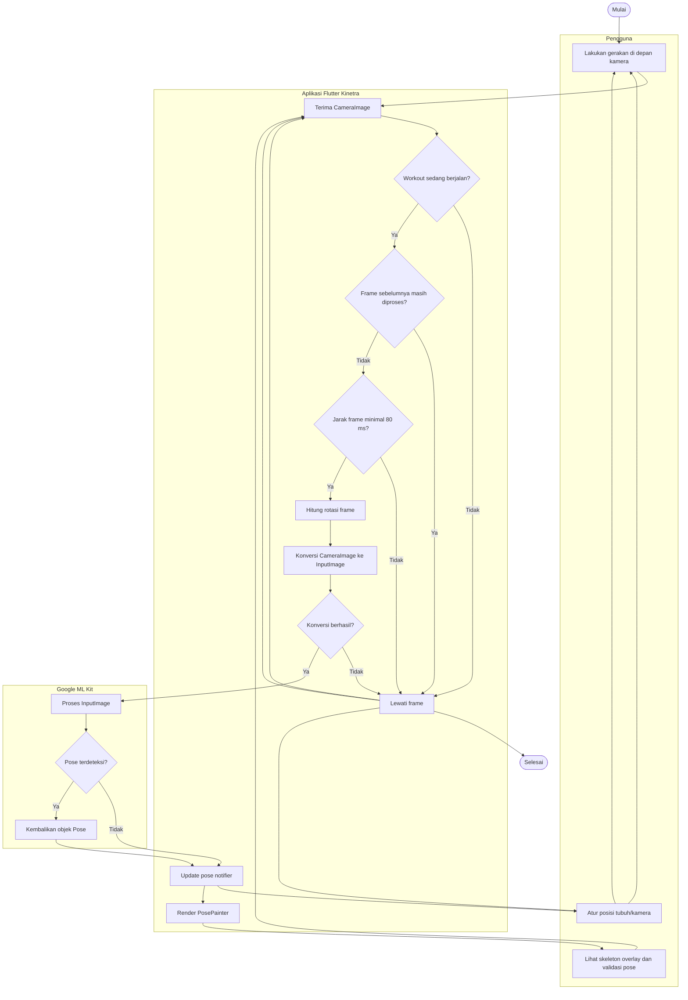
```mermaid
flowchart TD
    Start([Mulai])
    subgraph User["Pengguna"]
        MoveBody[Lakukan gerakan di depan kamera]
        AdjustPosition[Atur posisi tubuh/kamera]
        SeeOverlay[Lihat skeleton overlay dan validasi pose]
    end
    subgraph App["Aplikasi Flutter Kinetra"]
        ReceiveFrame[Terima CameraImage]
        IsWorkoutStarted{Workout sedang berjalan?}
        IsProcessing{Frame sebelumnya masih diproses?}
        ThrottleOk{Jarak frame minimal 80 ms?}
        ComputeRotation[Hitung rotasi frame]
        ConvertImage[Konversi CameraImage ke InputImage]
        ConversionOk{Konversi berhasil?}
        UpdatePoseNotifier[Update pose notifier]
        RenderOverlay[Render PosePainter]
        SkipFrame[Lewati frame]
    end
    subgraph MLKit["Google ML Kit"]
        ProcessImage[Proses InputImage]
        PoseDetected{Pose terdeteksi?}
        ReturnPose[Kembalikan objek Pose]
    end

    Start --> MoveBody --> ReceiveFrame --> IsWorkoutStarted
    IsWorkoutStarted -->|Tidak| SkipFrame --> End([Selesai])
    IsWorkoutStarted -->|Ya| IsProcessing
    IsProcessing -->|Ya| SkipFrame --> ReceiveFrame
    IsProcessing -->|Tidak| ThrottleOk
    ThrottleOk -->|Tidak| SkipFrame --> ReceiveFrame
    ThrottleOk -->|Ya| ComputeRotation --> ConvertImage --> ConversionOk
    ConversionOk -->|Tidak| SkipFrame --> AdjustPosition --> MoveBody
    ConversionOk -->|Ya| ProcessImage --> PoseDetected
    PoseDetected -->|Tidak| UpdatePoseNotifier --> AdjustPosition --> MoveBody
    PoseDetected -->|Ya| ReturnPose --> UpdatePoseNotifier --> RenderOverlay --> SeeOverlay --> ReceiveFrame
```

### 2.9 Activity Diagram - Menghitung Repetisi

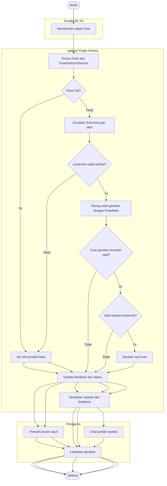
```mermaid
flowchart TD
    Start([Mulai])
    subgraph MLKit["Google ML Kit"]
        ProvidePose[Memberikan objek Pose]
    end
    subgraph App["Aplikasi Flutter Kinetra"]
        ReceivePose[Terima Pose dari PoseDetectorService]
        PoseNull{Pose null?}
        ChooseLogic[Gunakan ExerciseLogic aktif]
        ValidateLandmark{Landmark wajib terlihat?}
        CalculateAngle[Hitung sudut gerakan dengan PoseMath]
        PhaseChanged{Fase gerakan berubah valid?}
        CooldownPassed{Jeda repetisi terpenuhi?}
        IncrementRep[Tambah repCount]
        UpdateFeedback[Update feedback dan status]
        MarkInvalid[Set isPoseValid false]
        ShowStats[Tampilkan repetisi dan feedback]
    end
    subgraph User["Pengguna"]
        ContinueMovement[Lanjutkan gerakan]
        CorrectPose[Perbaiki posisi tubuh]
        SeeStats[Lihat jumlah repetisi]
    end

    Start --> ProvidePose --> ReceivePose --> PoseNull
    PoseNull -->|Ya| MarkInvalid --> UpdateFeedback --> CorrectPose --> ContinueMovement --> End([Selesai])
    PoseNull -->|Tidak| ChooseLogic --> ValidateLandmark
    ValidateLandmark -->|Tidak| MarkInvalid --> UpdateFeedback --> CorrectPose --> ContinueMovement --> End
    ValidateLandmark -->|Ya| CalculateAngle --> PhaseChanged
    PhaseChanged -->|Tidak| UpdateFeedback --> ShowStats --> ContinueMovement --> End
    PhaseChanged -->|Ya| CooldownPassed
    CooldownPassed -->|Tidak| UpdateFeedback --> ShowStats --> ContinueMovement --> End
    CooldownPassed -->|Ya| IncrementRep --> UpdateFeedback --> ShowStats --> SeeStats --> ContinueMovement --> End
```

### 2.10 Activity Diagram - Menyimpan Riwayat Latihan

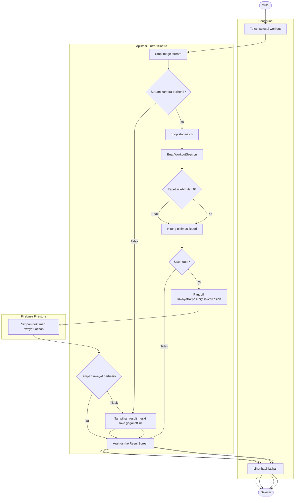
```mermaid
flowchart TD
    Start([Mulai])
    subgraph User["Pengguna"]
        FinishWorkout[Tekan selesai workout]
        SeeResult[Lihat hasil latihan]
    end
    subgraph App["Aplikasi Flutter Kinetra"]
        StopStream[Stop image stream]
        StreamStopped{Stream kamera berhenti?}
        StopStopwatch[Stop stopwatch]
        BuildSession[Buat WorkoutSession]
        HasReps{Repetisi lebih dari 0?}
        EstimateCalories[Hitung estimasi kalori]
        CheckUser{User login?}
        SaveSession[Panggil RiwayatRepository.saveSession]
        SaveSuccess{Simpan riwayat berhasil?}
        GoResult[Arahkan ke ResultScreen]
        ContinueOffline[Tampilkan result meski save gagal/offline]
    end
    subgraph DB["Firebase Firestore"]
        WriteHistory[Simpan dokumen riwayatLatihan]
    end

    Start --> FinishWorkout --> StopStream --> StreamStopped
    StreamStopped -->|Tidak| ContinueOffline --> GoResult --> SeeResult --> End([Selesai])
    StreamStopped -->|Ya| StopStopwatch --> BuildSession --> HasReps
    HasReps -->|Tidak| EstimateCalories
    HasReps -->|Ya| EstimateCalories
    EstimateCalories --> CheckUser
    CheckUser -->|Tidak| GoResult --> SeeResult --> End
    CheckUser -->|Ya| SaveSession --> WriteHistory --> SaveSuccess
    SaveSuccess -->|Ya| GoResult --> SeeResult --> End
    SaveSuccess -->|Tidak| ContinueOffline --> GoResult --> SeeResult --> End
```

### 2.11 Activity Diagram - Melihat Riwayat Latihan

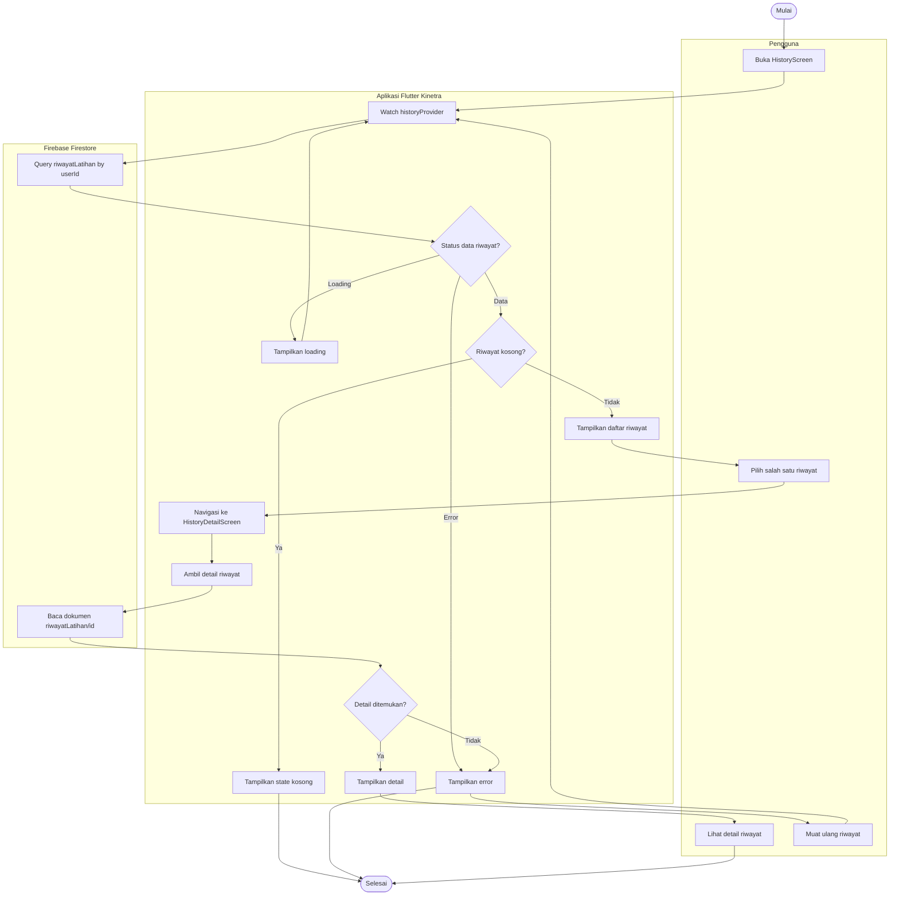
```mermaid
flowchart TD
    Start([Mulai])
    subgraph User["Pengguna"]
        OpenHistory[Buka HistoryScreen]
        SelectHistory[Pilih salah satu riwayat]
        ViewDetail[Lihat detail riwayat]
        RetryLoad[Muat ulang riwayat]
    end
    subgraph App["Aplikasi Flutter Kinetra"]
        WatchHistory[Watch historyProvider]
        HistoryState{Status data riwayat?}
        RenderLoading[Tampilkan loading]
        RenderHistory[Tampilkan daftar riwayat]
        HistoryEmpty{Riwayat kosong?}
        RenderEmpty[Tampilkan state kosong]
        NavigateDetail[Navigasi ke HistoryDetailScreen]
        LoadHistoryDetail[Ambil detail riwayat]
        DetailFound{Detail ditemukan?}
        RenderDetail[Tampilkan detail]
        ShowError[Tampilkan error]
    end
    subgraph DB["Firebase Firestore"]
        QueryHistory[Query riwayatLatihan by userId]
        ReadHistoryDoc[Baca dokumen riwayatLatihan/id]
    end

    Start --> OpenHistory --> WatchHistory --> QueryHistory --> HistoryState
    HistoryState -->|Loading| RenderLoading --> WatchHistory
    HistoryState -->|Error| ShowError --> RetryLoad --> WatchHistory
    HistoryState -->|Data| HistoryEmpty
    HistoryEmpty -->|Ya| RenderEmpty --> End([Selesai])
    HistoryEmpty -->|Tidak| RenderHistory --> SelectHistory --> NavigateDetail --> LoadHistoryDetail --> ReadHistoryDoc --> DetailFound
    DetailFound -->|Tidak| ShowError --> End
    DetailFound -->|Ya| RenderDetail --> ViewDetail --> End
```

### 2.12 Activity Diagram - Melihat Profil

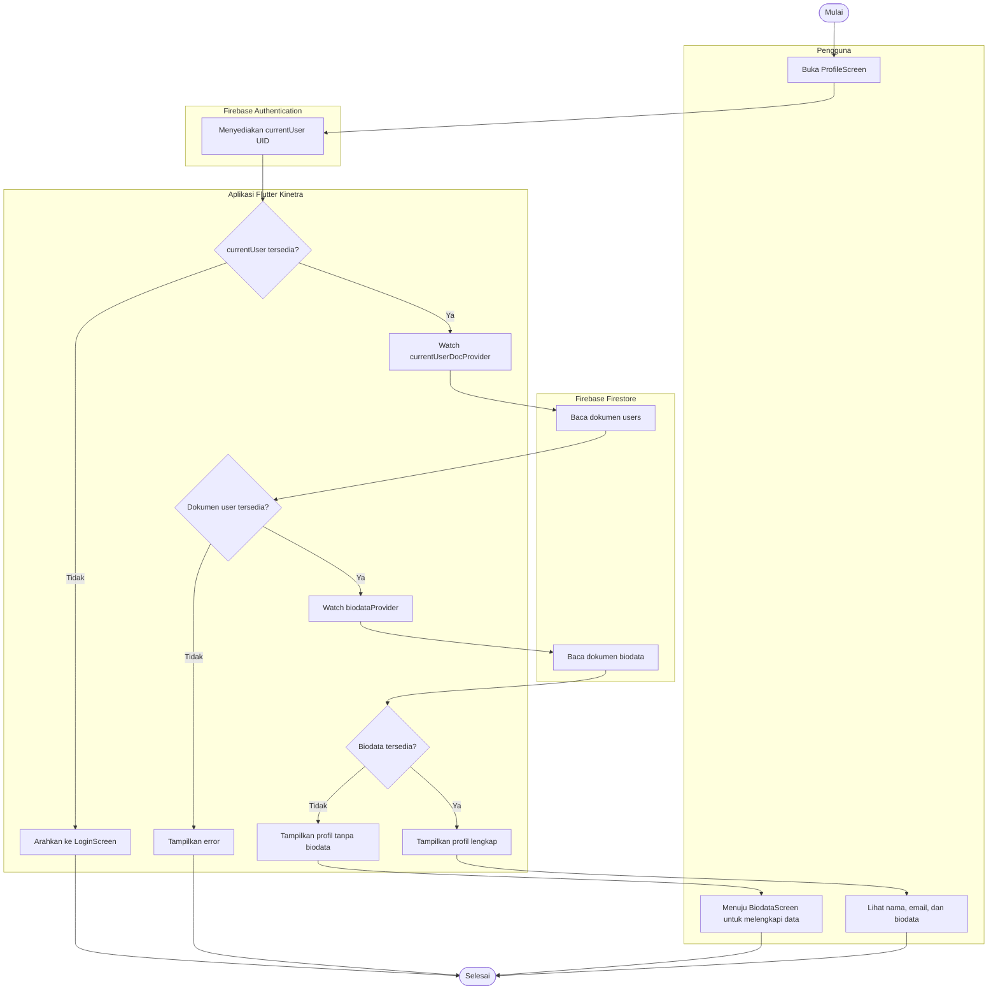
```mermaid
flowchart TD
    Start([Mulai])
    subgraph User["Pengguna"]
        OpenProfile[Buka ProfileScreen]
        ViewProfile[Lihat nama, email, dan biodata]
        GoBiodata[Menuju BiodataScreen untuk melengkapi data]
    end
    subgraph App["Aplikasi Flutter Kinetra"]
        HasCurrentUser{currentUser tersedia?}
        WatchCurrentUser[Watch currentUserDocProvider]
        UserDocState{Dokumen user tersedia?}
        WatchBiodata[Watch biodataProvider]
        BiodataState{Biodata tersedia?}
        RenderProfile[Tampilkan profil lengkap]
        RenderPartial[Tampilkan profil tanpa biodata]
        RedirectLogin[Arahkan ke LoginScreen]
        ShowError[Tampilkan error]
    end
    subgraph Auth["Firebase Authentication"]
        ProvideCurrentUser[Menyediakan currentUser UID]
    end
    subgraph DB["Firebase Firestore"]
        ReadUser[Baca dokumen users]
        ReadBiodata[Baca dokumen biodata]
    end

    Start --> OpenProfile --> ProvideCurrentUser --> HasCurrentUser
    HasCurrentUser -->|Tidak| RedirectLogin --> End([Selesai])
    HasCurrentUser -->|Ya| WatchCurrentUser --> ReadUser --> UserDocState
    UserDocState -->|Tidak| ShowError --> End
    UserDocState -->|Ya| WatchBiodata --> ReadBiodata --> BiodataState
    BiodataState -->|Tidak| RenderPartial --> GoBiodata --> End
    BiodataState -->|Ya| RenderProfile --> ViewProfile --> End
```

## 3. Class Diagram

Class diagram ini menampilkan entity domain, repository, model Firestore, logic penghitung repetisi, service kamera/ML Kit, serta hubungan class aplikasi dengan teknologi eksternal.

```mermaid
classDiagram
    direction LR

    class UserEntity {
        +String userId
        +String nama
        +String email
        +bool isBiodataCompleted
    }

    class BiodataEntity {
        +String biodataId
        +String userId
        +String jenisKelamin
        +int usia
        +TargetLatihan targetLatihan
        +DateTime updatedAt
    }

    class LatihanEntity {
        +String latihanId
        +String namaLatihan
        +String kategoriLatihan
        +String deskripsi
        +int targetRepetisi
        +int targetDurasi
        +String targetLatihan
        +bool isActive
    }

    class RiwayatEntity {
        +String riwayatId
        +String userId
        +String sesiId
        +DateTime tanggalLatihan
        +String namaLatihan
        +int hasilRepetisi
        +int durasiLatihan
        +double? kaloriEstimasi
        +String? feedbackAkhir
    }

    class WorkoutSession {
        +String sesiId
        +String latihanId
        +String namaLatihan
        +int repetitions
        +int durationSeconds
        +String feedbackAkhir
        +double kaloriEstimasi
    }

    class TargetLatihan {
        <<enumeration>>
        kebugaran
        massaOtot
        kelincahan
    }

    class AuthRepository {
        <<interface>>
        +authStateChanges()
        +currentUser
        +signIn(email, password)
        +signUp(nama, email, password)
        +signOut()
    }

    class UserRepository {
        <<interface>>
        +watchUser(userId)
        +getUser(userId)
    }

    class BiodataRepository {
        <<interface>>
        +watchBiodata(userId)
        +saveBiodata(userId, jenisKelamin, usia, targetLatihan)
    }

    class LatihanRepository {
        <<interface>>
        +watchAllActive()
        +watchByTarget(targetLatihan)
        +getById(latihanId)
    }

    class RiwayatRepository {
        <<interface>>
        +watchByUser(userId)
        +getById(riwayatId)
        +saveSession(userId, session)
    }

    class AuthRepositoryImpl {
        -FirebaseAuth _auth
        -FirebaseFirestore _firestore
        +authStateChanges()
        +signIn(email, password)
        +signUp(nama, email, password)
        +signOut()
    }

    class UserRepositoryImpl {
        -FirebaseFirestore _firestore
        +watchUser(userId)
        +getUser(userId)
    }

    class BiodataRepositoryImpl {
        -FirebaseFirestore _firestore
        +watchBiodata(userId)
        +saveBiodata(userId, jenisKelamin, usia, targetLatihan)
    }

    class LatihanRepositoryImpl {
        -FirebaseFirestore _firestore
        +watchAllActive()
        +watchByTarget(targetLatihan)
        +getById(latihanId)
    }

    class RiwayatRepositoryImpl {
        -FirebaseFirestore _firestore
        +watchByUser(userId)
        +getById(riwayatId)
        +saveSession(userId, session)
    }

    class UserModel {
        +fromFirestore(doc)
        +toFirestore()
        +toEntity()
    }

    class BiodataModel {
        +fromFirestore(doc)
        +toFirestore()
        +toEntity()
    }

    class LatihanModel {
        +fromFirestore(doc)
        +toEntity()
    }

    class RiwayatModel {
        +fromFirestore(doc)
        +toFirestore()
        +toEntity()
    }

    class DetectionScreen {
        -CameraService _cameraService
        -PoseDetectorService _poseService
        -ExerciseLogic _logic
        +initState()
        +build(context)
        -_beginWorkout()
        -_finishWorkout()
    }

    class CameraService {
        -CameraController _controller
        +initialize(useFrontCamera)
        +startImageStream(onImage)
        +stopImageStream()
        +dispose()
    }

    class PoseDetectorService {
        -PoseDetector _detector
        -bool _isProcessing
        +initialize()
        +processCameraImage(image, rotation, isFrontCamera)
        +computeRotation(sensorOrientation, deviceOrientation, isFrontCamera)
        +dispose()
    }

    class ExerciseLogic {
        <<interface>>
        +int repCount
        +String feedback
        +String status
        +bool isPoseValid
        +processPose(pose)
        +reset()
    }

    class ExerciseLogicFactory {
        +fromLatihanId(latihanId)
    }

    class PoseMath {
        <<utility>>
        +isVisible(landmark)
        +landmarkScore(landmark)
        +angle(a, b, c)
    }

    class CalorieEstimator {
        <<utility>>
        +estimate(latihanId, repetitions, durationSeconds)
    }

    class TrainingTargetCalculator {
        <<utility>>
        +forLatihan(latihan, biodata)
    }

    class LocalLatihanSeed {
        <<fallback datasource>>
        +all()
    }

    class PushUpLogic
    class SquatLogic
    class JumpingJackLogic
    class HighKneeLogic
    class MountainClimberLogic
    class SitUpLogic
    class LungeLogic
    class SkaterJumpLogic
    class BurpeeLogic

    class FirebaseAuth {
        <<external>>
        +authStateChanges()
        +signInWithEmailAndPassword()
        +createUserWithEmailAndPassword()
        +signOut()
    }

    class FirebaseFirestore {
        <<external>>
        +collection(name)
    }

    class PoseDetector {
        <<external ML Kit>>
        +processImage(inputImage)
        +close()
    }

    class CameraController {
        <<external camera plugin>>
        +initialize()
        +startImageStream()
        +stopImageStream()
    }

    UserEntity "1" --> "0..1" BiodataEntity : memiliki
    UserEntity "1" --> "0..*" RiwayatEntity : memiliki
    LatihanEntity "1" --> "0..*" WorkoutSession : dipilih pada
    WorkoutSession "1" --> "0..1" RiwayatEntity : disimpan sebagai
    BiodataEntity --> TargetLatihan

    AuthRepositoryImpl ..|> AuthRepository
    UserRepositoryImpl ..|> UserRepository
    BiodataRepositoryImpl ..|> BiodataRepository
    LatihanRepositoryImpl ..|> LatihanRepository
    RiwayatRepositoryImpl ..|> RiwayatRepository

    UserModel ..> UserEntity : toEntity
    BiodataModel ..> BiodataEntity : toEntity
    LatihanModel ..> LatihanEntity : toEntity
    RiwayatModel ..> RiwayatEntity : toEntity

    AuthRepositoryImpl --> FirebaseAuth
    AuthRepositoryImpl --> FirebaseFirestore
    UserRepositoryImpl --> FirebaseFirestore
    BiodataRepositoryImpl --> FirebaseFirestore
    LatihanRepositoryImpl --> FirebaseFirestore
    RiwayatRepositoryImpl --> FirebaseFirestore

    DetectionScreen --> CameraService
    DetectionScreen --> PoseDetectorService
    DetectionScreen --> ExerciseLogic
    DetectionScreen --> WorkoutSession
    DetectionScreen --> CalorieEstimator : estimasi kalori
    DetectionScreen --> TrainingTargetCalculator : target personal
    DetectionScreen --> LocalLatihanSeed : fallback latihan
    CameraService --> CameraController
    PoseDetectorService --> PoseDetector
    PoseDetectorService ..> PoseMath : data Pose dipakai logic
    ExerciseLogicFactory ..> ExerciseLogic : membuat
    ExerciseLogic ..> PoseMath : validasi landmark dan sudut

    PushUpLogic ..|> ExerciseLogic
    SquatLogic ..|> ExerciseLogic
    JumpingJackLogic ..|> ExerciseLogic
    HighKneeLogic ..|> ExerciseLogic
    MountainClimberLogic ..|> ExerciseLogic
    SitUpLogic ..|> ExerciseLogic
    LungeLogic ..|> ExerciseLogic
    SkaterJumpLogic ..|> ExerciseLogic
    BurpeeLogic ..|> ExerciseLogic
```

## 4. Sequence Diagram

Sequence diagram berikut dibuat rinci per alur turunan dari use case inti. Diagram memakai blok `alt`, `else`, `opt`, dan `loop` untuk memperlihatkan detail kondisi sukses/gagal, data kosong, proses berulang, dan percabangan sistem.

### 4.1 Sequence Diagram - Registrasi Akun

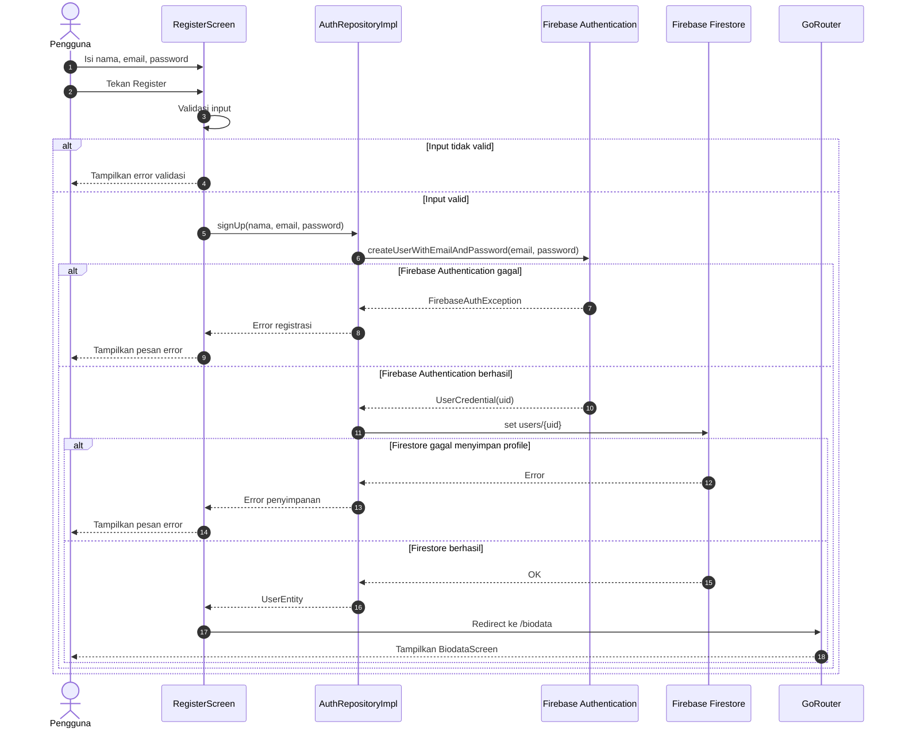
```mermaid
sequenceDiagram
    autonumber
    actor User as Pengguna
    participant Register as RegisterScreen
    participant AuthRepo as AuthRepositoryImpl
    participant FirebaseAuth as Firebase Authentication
    participant Firestore as Firebase Firestore
    participant Router as GoRouter

    User->>Register: Isi nama, email, password
    User->>Register: Tekan Register
    Register->>Register: Validasi input
    alt Input tidak valid
        Register-->>User: Tampilkan error validasi
    else Input valid
        Register->>AuthRepo: signUp(nama, email, password)
        AuthRepo->>FirebaseAuth: createUserWithEmailAndPassword(email, password)
        alt Firebase Authentication gagal
            FirebaseAuth-->>AuthRepo: FirebaseAuthException
            AuthRepo-->>Register: Error registrasi
            Register-->>User: Tampilkan pesan error
        else Firebase Authentication berhasil
            FirebaseAuth-->>AuthRepo: UserCredential(uid)
            AuthRepo->>Firestore: set users/{uid}
            alt Firestore gagal menyimpan profile
                Firestore-->>AuthRepo: Error
                AuthRepo-->>Register: Error penyimpanan
                Register-->>User: Tampilkan pesan error
            else Firestore berhasil
                Firestore-->>AuthRepo: OK
                AuthRepo-->>Register: UserEntity
                Register->>Router: Redirect ke /biodata
                Router-->>User: Tampilkan BiodataScreen
            end
        end
    end
```

### 4.2 Sequence Diagram - Login

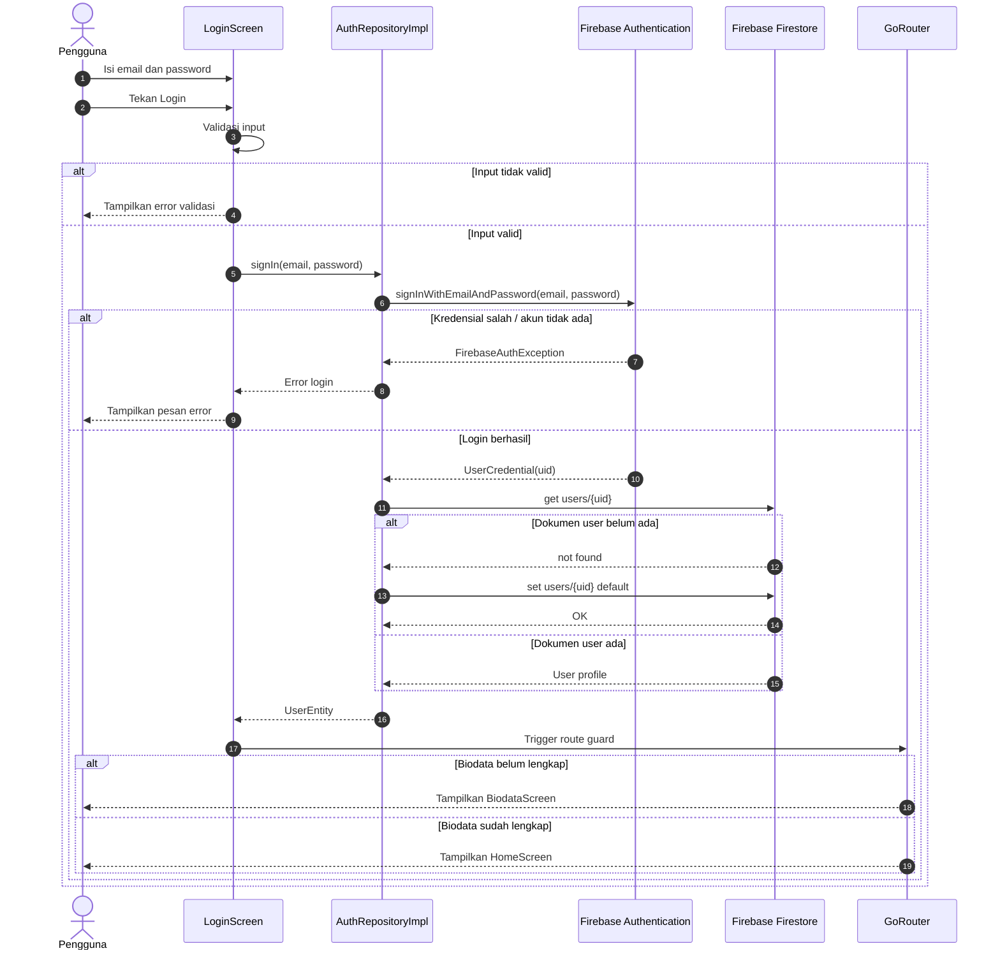
```mermaid
sequenceDiagram
    autonumber
    actor User as Pengguna
    participant Login as LoginScreen
    participant AuthRepo as AuthRepositoryImpl
    participant FirebaseAuth as Firebase Authentication
    participant Firestore as Firebase Firestore
    participant Router as GoRouter

    User->>Login: Isi email dan password
    User->>Login: Tekan Login
    Login->>Login: Validasi input
    alt Input tidak valid
        Login-->>User: Tampilkan error validasi
    else Input valid
        Login->>AuthRepo: signIn(email, password)
        AuthRepo->>FirebaseAuth: signInWithEmailAndPassword(email, password)
        alt Kredensial salah / akun tidak ada
            FirebaseAuth-->>AuthRepo: FirebaseAuthException
            AuthRepo-->>Login: Error login
            Login-->>User: Tampilkan pesan error
        else Login berhasil
            FirebaseAuth-->>AuthRepo: UserCredential(uid)
            AuthRepo->>Firestore: get users/{uid}
            alt Dokumen user belum ada
                Firestore-->>AuthRepo: not found
                AuthRepo->>Firestore: set users/{uid} default
                Firestore-->>AuthRepo: OK
            else Dokumen user ada
                Firestore-->>AuthRepo: User profile
            end
            AuthRepo-->>Login: UserEntity
            Login->>Router: Trigger route guard
            alt Biodata belum lengkap
                Router-->>User: Tampilkan BiodataScreen
            else Biodata sudah lengkap
                Router-->>User: Tampilkan HomeScreen
            end
        end
    end
```

### 4.3 Sequence Diagram - Logout

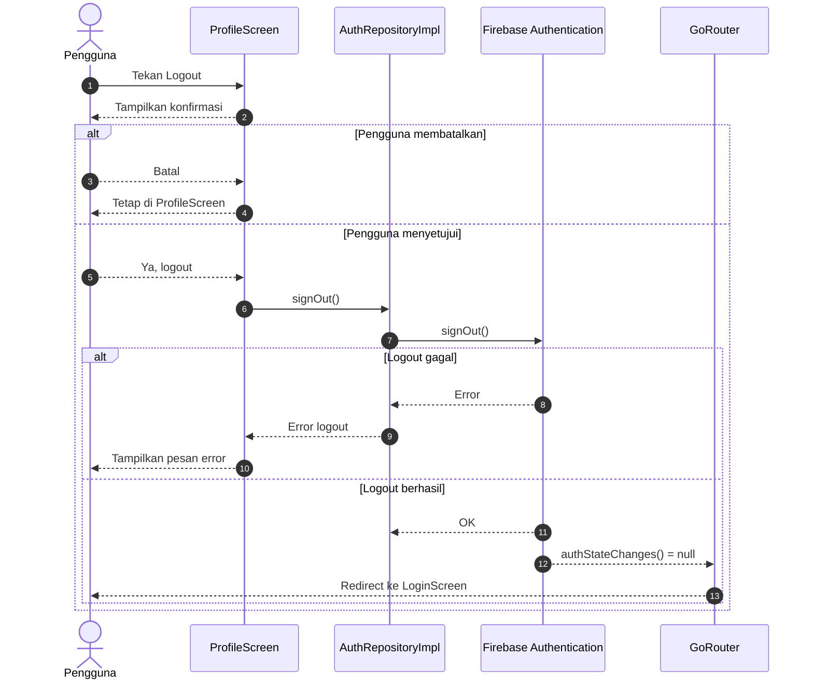
```mermaid
sequenceDiagram
    autonumber
    actor User as Pengguna
    participant Profile as ProfileScreen
    participant AuthRepo as AuthRepositoryImpl
    participant FirebaseAuth as Firebase Authentication
    participant Router as GoRouter

    User->>Profile: Tekan Logout
    Profile-->>User: Tampilkan konfirmasi
    alt Pengguna membatalkan
        User-->>Profile: Batal
        Profile-->>User: Tetap di ProfileScreen
    else Pengguna menyetujui
        User-->>Profile: Ya, logout
        Profile->>AuthRepo: signOut()
        AuthRepo->>FirebaseAuth: signOut()
        alt Logout gagal
            FirebaseAuth-->>AuthRepo: Error
            AuthRepo-->>Profile: Error logout
            Profile-->>User: Tampilkan pesan error
        else Logout berhasil
            FirebaseAuth-->>AuthRepo: OK
            FirebaseAuth-->>Router: authStateChanges() = null
            Router-->>User: Redirect ke LoginScreen
        end
    end
```

### 4.4 Sequence Diagram - Mengisi Biodata

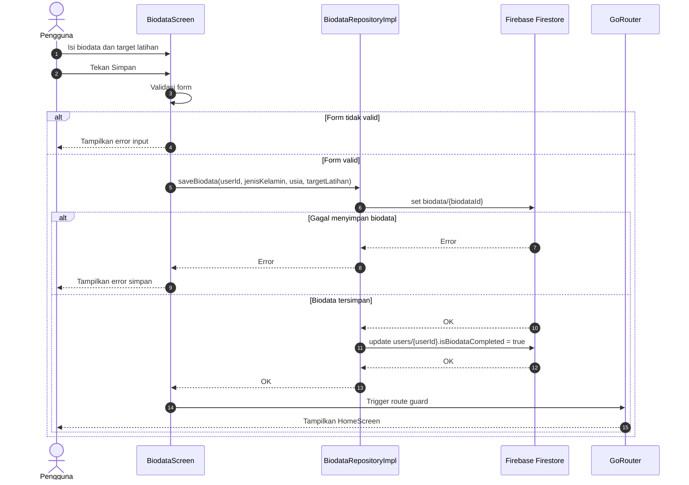
```mermaid
sequenceDiagram
    autonumber
    actor User as Pengguna
    participant Biodata as BiodataScreen
    participant BiodataRepo as BiodataRepositoryImpl
    participant Firestore as Firebase Firestore
    participant Router as GoRouter

    User->>Biodata: Isi biodata dan target latihan
    User->>Biodata: Tekan Simpan
    Biodata->>Biodata: Validasi form
    alt Form tidak valid
        Biodata-->>User: Tampilkan error input
    else Form valid
        Biodata->>BiodataRepo: saveBiodata(userId, jenisKelamin, usia, targetLatihan)
        BiodataRepo->>Firestore: set biodata/{biodataId}
        alt Gagal menyimpan biodata
            Firestore-->>BiodataRepo: Error
            BiodataRepo-->>Biodata: Error
            Biodata-->>User: Tampilkan error simpan
        else Biodata tersimpan
            Firestore-->>BiodataRepo: OK
            BiodataRepo->>Firestore: update users/{userId}.isBiodataCompleted = true
            Firestore-->>BiodataRepo: OK
            BiodataRepo-->>Biodata: OK
            Biodata->>Router: Trigger route guard
            Router-->>User: Tampilkan HomeScreen
        end
    end
```

### 4.5 Sequence Diagram - Melihat Rekomendasi Latihan

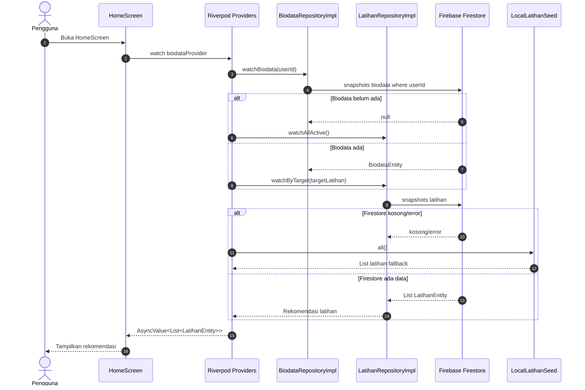
```mermaid
sequenceDiagram
    autonumber
    actor User as Pengguna
    participant Home as HomeScreen
    participant Providers as Riverpod Providers
    participant BiodataRepo as BiodataRepositoryImpl
    participant LatihanRepo as LatihanRepositoryImpl
    participant Firestore as Firebase Firestore
    participant LocalSeed as LocalLatihanSeed

    User->>Home: Buka HomeScreen
    Home->>Providers: watch biodataProvider
    Providers->>BiodataRepo: watchBiodata(userId)
    BiodataRepo->>Firestore: snapshots biodata where userId
    alt Biodata belum ada
        Firestore-->>BiodataRepo: null
        Providers->>LatihanRepo: watchAllActive()
    else Biodata ada
        Firestore-->>BiodataRepo: BiodataEntity
        Providers->>LatihanRepo: watchByTarget(targetLatihan)
    end
    LatihanRepo->>Firestore: snapshots latihan
    alt Firestore kosong/error
        Firestore-->>LatihanRepo: kosong/error
        Providers->>LocalSeed: all()
        LocalSeed-->>Providers: List latihan fallback
    else Firestore ada data
        Firestore-->>LatihanRepo: List LatihanEntity
        LatihanRepo-->>Providers: Rekomendasi latihan
    end
    Providers-->>Home: AsyncValue<List<LatihanEntity>>
    Home-->>User: Tampilkan rekomendasi
```

### 4.6 Sequence Diagram - Melihat Daftar Latihan

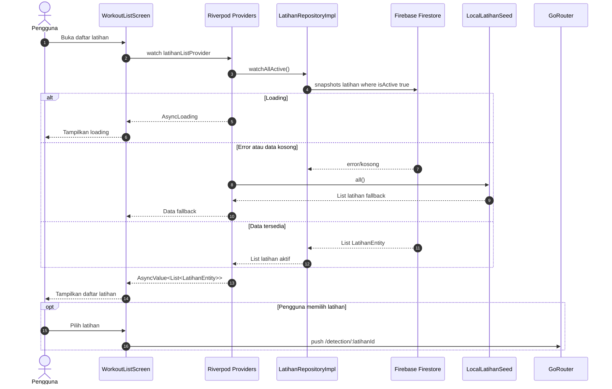
```mermaid
sequenceDiagram
    autonumber
    actor User as Pengguna
    participant WorkoutList as WorkoutListScreen
    participant Providers as Riverpod Providers
    participant LatihanRepo as LatihanRepositoryImpl
    participant Firestore as Firebase Firestore
    participant LocalSeed as LocalLatihanSeed
    participant Router as GoRouter

    User->>WorkoutList: Buka daftar latihan
    WorkoutList->>Providers: watch latihanListProvider
    Providers->>LatihanRepo: watchAllActive()
    LatihanRepo->>Firestore: snapshots latihan where isActive true
    alt Loading
        Providers-->>WorkoutList: AsyncLoading
        WorkoutList-->>User: Tampilkan loading
    else Error atau data kosong
        Firestore-->>LatihanRepo: error/kosong
        Providers->>LocalSeed: all()
        LocalSeed-->>Providers: List latihan fallback
        Providers-->>WorkoutList: Data fallback
    else Data tersedia
        Firestore-->>LatihanRepo: List LatihanEntity
        LatihanRepo-->>Providers: List latihan aktif
    end
    Providers-->>WorkoutList: AsyncValue<List<LatihanEntity>>
    WorkoutList-->>User: Tampilkan daftar latihan
    opt Pengguna memilih latihan
        User->>WorkoutList: Pilih latihan
        WorkoutList->>Router: push /detection/:latihanId
    end
```

### 4.7 Sequence Diagram - Memulai Sesi Workout

```mermaid
sequenceDiagram
    autonumber
    actor User as Pengguna
    participant Detection as DetectionScreen
    participant LatihanRepo as LatihanRepositoryImpl
    participant Firestore as Firebase Firestore
    participant LocalSeed as LocalLatihanSeed
    participant Permission as PermissionHandler
    participant Camera as CameraService
    participant MLKit as Google ML Kit PoseDetector
    participant Factory as ExerciseLogicFactory

    User->>Detection: Masuk ke halaman deteksi
    Detection->>LatihanRepo: getById(latihanId)
    LatihanRepo->>Firestore: query latihan
    alt Latihan tidak ditemukan di Firestore
        Firestore-->>LatihanRepo: null
        Detection->>LocalSeed: Cari latihanId
        LocalSeed-->>Detection: LatihanEntity fallback
    else Latihan ditemukan
        Firestore-->>LatihanRepo: LatihanEntity
        LatihanRepo-->>Detection: Detail latihan
    end
    Detection->>Detection: Hitung target personal dari biodata
    Detection->>Factory: fromLatihanId(latihanId)
    Factory-->>Detection: ExerciseLogic
    Detection->>Permission: request camera
    alt Izin kamera ditolak
        Permission-->>Detection: denied
        Detection-->>User: Tampilkan tombol buka pengaturan
    else Izin kamera diberikan
        Permission-->>Detection: granted
        Detection->>Camera: initialize(useFrontCamera: true)
        alt Kamera gagal dibuka
            Camera-->>Detection: CameraException
            Detection-->>User: Tampilkan snackbar error
        else Kamera siap
            Camera-->>Detection: Kamera siap
            Detection->>MLKit: initialize PoseDetector stream mode
            MLKit-->>Detection: PoseDetector siap
            loop Countdown 5 detik
                Detection-->>User: Update angka countdown
            end
            Detection->>Camera: startImageStream(callback)
        end
    end
```

### 4.8 Sequence Diagram - Mendeteksi Pose Real-time

```mermaid
sequenceDiagram
    autonumber
    actor User as Pengguna
    participant Camera as CameraService
    participant Detection as DetectionScreen
    participant PoseService as PoseDetectorService
    participant MLKit as Google ML Kit PoseDetector
    participant Overlay as PosePainter

    User->>Camera: Bergerak di depan kamera
    loop Selama workoutStarted = true
        Camera-->>Detection: CameraImage frame
        alt PoseService sedang memproses frame lain
            Detection-->>Camera: Skip frame
        else Frame boleh diproses
            Detection->>PoseService: computeRotation(...)
            Detection->>PoseService: processCameraImage(image, rotation, isFrontCamera)
            PoseService->>PoseService: Convert CameraImage ke InputImage
            alt Konversi gagal
                PoseService-->>Detection: null
                Detection-->>User: Feedback pose tidak terdeteksi
            else Konversi berhasil
                PoseService->>MLKit: processImage(inputImage)
                alt ML Kit tidak menemukan pose
                    MLKit-->>PoseService: empty list
                    PoseService-->>Detection: null
                    Detection-->>User: Minta pengguna atur posisi
                else ML Kit menemukan pose
                    MLKit-->>PoseService: List<Pose>
                    PoseService-->>Detection: Pose pertama
                    Detection->>Overlay: Update pose dan validasi
                    Overlay-->>User: Render skeleton overlay
                end
            end
        end
    end
```

### 4.9 Sequence Diagram - Menghitung Repetisi

```mermaid
sequenceDiagram
    autonumber
    participant MLKit as Google ML Kit PoseDetector
    participant Detection as DetectionScreen
    participant Logic as ExerciseLogic
    participant PoseMath as PoseMath
    actor User as Pengguna

    MLKit-->>Detection: Pose hasil deteksi
    Detection->>Logic: processPose(pose)
    alt Pose null
        Logic-->>Detection: isPoseValid=false, feedback pose tidak terdeteksi
        Detection-->>User: Tampilkan feedback perbaiki posisi
    else Pose tersedia
        Logic->>PoseMath: isVisible(landmark wajib)
        alt Landmark tidak lengkap
            PoseMath-->>Logic: false
            Logic-->>Detection: isPoseValid=false, feedback pose tidak terdeteksi
            Detection-->>User: Tampilkan feedback perbaiki posisi
        else Landmark lengkap
            PoseMath-->>Logic: true
            Logic->>PoseMath: angle(titikA, titikB, titikC)
            PoseMath-->>Logic: Sudut gerakan
            Logic->>Logic: Deteksi fase up/down atau standing/squatting
            alt Fase belum membentuk repetisi valid
                Logic-->>Detection: status dan feedback diperbarui
            else Fase valid dan cooldown terpenuhi
                Logic->>Logic: repCount++
                Logic-->>Detection: repCount, feedback, isPoseValid
            end
            Detection-->>User: Tampilkan repetisi dan feedback
        end
    end
```

### 4.10 Sequence Diagram - Menyimpan Riwayat Latihan

```mermaid
sequenceDiagram
    autonumber
    actor User as Pengguna
    participant Detection as DetectionScreen
    participant Camera as CameraService
    participant Calories as CalorieEstimator
    participant Auth as Firebase Authentication
    participant RiwayatRepo as RiwayatRepositoryImpl
    participant Firestore as Firebase Firestore
    participant Router as GoRouter
    participant Result as ResultScreen

    User->>Detection: Tekan selesai
    Detection->>Camera: stopImageStream()
    alt Stream gagal berhenti
        Camera-->>Detection: Error
        Detection-->>User: Tetap lanjut ke hasil dengan cleanup terbaik
    else Stream berhenti
        Camera-->>Detection: OK
    end
    Detection->>Detection: Stop stopwatch dan baca repCount
    Detection->>Calories: estimate(latihanId, reps, duration)
    Calories-->>Detection: kaloriEstimasi
    Detection->>Detection: Buat WorkoutSession
    Detection->>Auth: currentUser
    alt User tidak login atau offline
        Auth-->>Detection: null
        Detection->>Router: pushReplacement(/result, session)
    else User login
        Auth-->>Detection: uid
        Detection->>RiwayatRepo: saveSession(userId, session)
        RiwayatRepo->>Firestore: set riwayatLatihan/{riwayatId}
        alt Simpan Firestore gagal
            Firestore-->>RiwayatRepo: Error
            RiwayatRepo-->>Detection: Error
            Detection->>Router: pushReplacement(/result, session)
        else Simpan Firestore berhasil
            Firestore-->>RiwayatRepo: OK
            RiwayatRepo-->>Detection: OK
            Detection->>Router: pushReplacement(/result, session)
        end
    end
    Router->>Result: Tampilkan hasil
    Result-->>User: Repetisi, durasi, kalori, feedback
```

### 4.11 Sequence Diagram - Melihat Riwayat Latihan

```mermaid
sequenceDiagram
    autonumber
    actor User as Pengguna
    participant History as HistoryScreen
    participant Providers as Riverpod Providers
    participant RiwayatRepo as RiwayatRepositoryImpl
    participant Firestore as Firebase Firestore
    participant Router as GoRouter
    participant Detail as HistoryDetailScreen

    User->>History: Buka HistoryScreen
    History->>Providers: watch historyProvider
    Providers->>RiwayatRepo: watchByUser(userId)
    RiwayatRepo->>Firestore: snapshots riwayatLatihan where userId
    alt Loading
        Providers-->>History: AsyncLoading
        History-->>User: Tampilkan loading
    else Error
        Firestore-->>RiwayatRepo: Error
        Providers-->>History: AsyncError
        History-->>User: Tampilkan error dan opsi reload
    else Data tersedia
        Firestore-->>RiwayatRepo: List RiwayatEntity
        RiwayatRepo-->>Providers: List riwayat terurut
        Providers-->>History: AsyncData
        alt Riwayat kosong
            History-->>User: Tampilkan state kosong
        else Riwayat ada
            History-->>User: Tampilkan daftar riwayat
            User->>History: Pilih riwayat
            History->>Router: push /history/:id
            Router->>Detail: Buat HistoryDetailScreen(id)
            Detail->>RiwayatRepo: getById(riwayatId)
            RiwayatRepo->>Firestore: get riwayatLatihan/{id}
            alt Detail tidak ditemukan
                Firestore-->>RiwayatRepo: not found
                Detail-->>User: Tampilkan error detail
            else Detail ditemukan
                Firestore-->>RiwayatRepo: RiwayatEntity
                RiwayatRepo-->>Detail: Detail riwayat
                Detail-->>User: Tampilkan detail
            end
        end
    end
```

### 4.12 Sequence Diagram - Melihat Profil

```mermaid
sequenceDiagram
    autonumber
    actor User as Pengguna
    participant Profile as ProfileScreen
    participant FirebaseAuth as Firebase Authentication
    participant Providers as Riverpod Providers
    participant UserRepo as UserRepositoryImpl
    participant BiodataRepo as BiodataRepositoryImpl
    participant Firestore as Firebase Firestore
    participant Router as GoRouter

    User->>Profile: Buka ProfileScreen
    Profile->>FirebaseAuth: currentUser.uid
    alt User tidak login
        FirebaseAuth-->>Profile: null
        Profile->>Router: Redirect ke /login
    else User login
        FirebaseAuth-->>Profile: UID pengguna
        Profile->>Providers: watch currentUserDocProvider
        Providers->>UserRepo: watchUser(uid)
        UserRepo->>Firestore: snapshots users/{uid}
        alt User profile tidak ditemukan
            Firestore-->>UserRepo: null
            Providers-->>Profile: Data user kosong
            Profile-->>User: Tampilkan error profil
        else User profile ditemukan
            Firestore-->>UserRepo: UserEntity
            Profile->>Providers: watch biodataProvider
            Providers->>BiodataRepo: watchBiodata(uid)
            BiodataRepo->>Firestore: snapshots biodata where userId
            alt Biodata belum ada
                Firestore-->>BiodataRepo: null
                Providers-->>Profile: UserEntity tanpa biodata
                Profile-->>User: Tampilkan profil parsial dan CTA lengkapi biodata
            else Biodata ada
                Firestore-->>BiodataRepo: BiodataEntity
                Providers-->>Profile: Data profil lengkap
                Profile-->>User: Tampilkan profil lengkap
            end
        end
    end
```

## Catatan Teknologi Eksternal

| Teknologi | Peran dalam sistem |
| --- | --- |
| Firebase Authentication | Mengelola registrasi, login, logout, dan status autentikasi pengguna. |
| Firebase Firestore | Menyimpan profil pengguna, biodata, katalog latihan, dan riwayat latihan. |
| Google ML Kit Pose Detection | Mendeteksi landmark tubuh dari frame kamera untuk dihitung oleh `ExerciseLogic`. |
