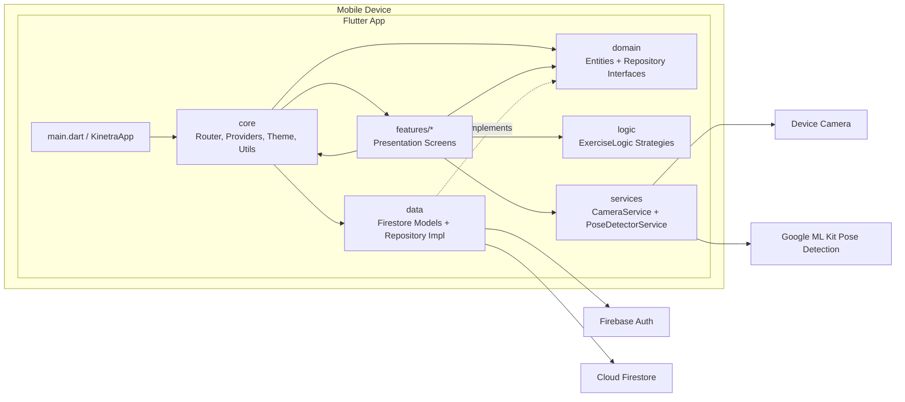
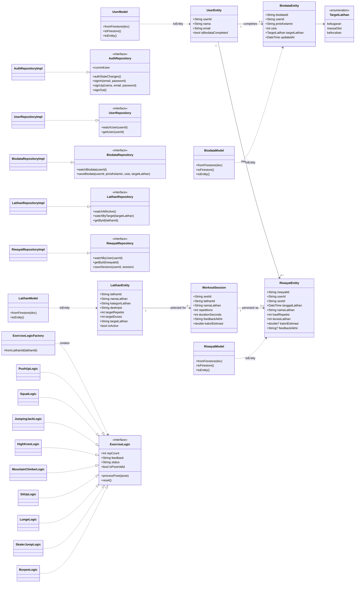
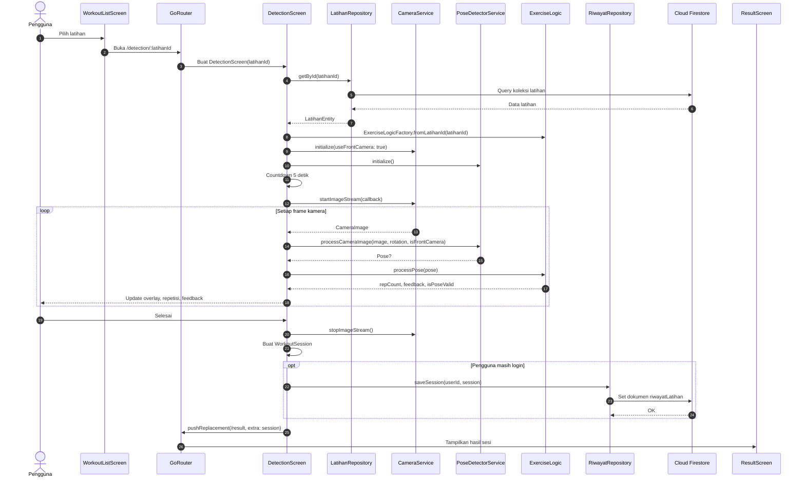
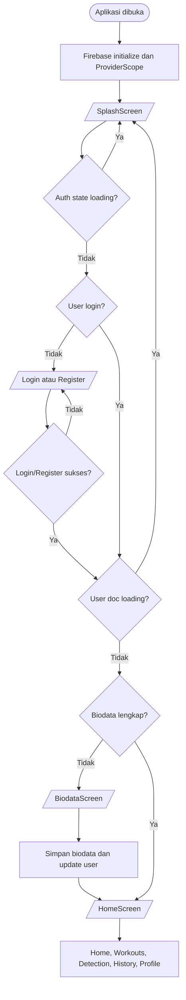
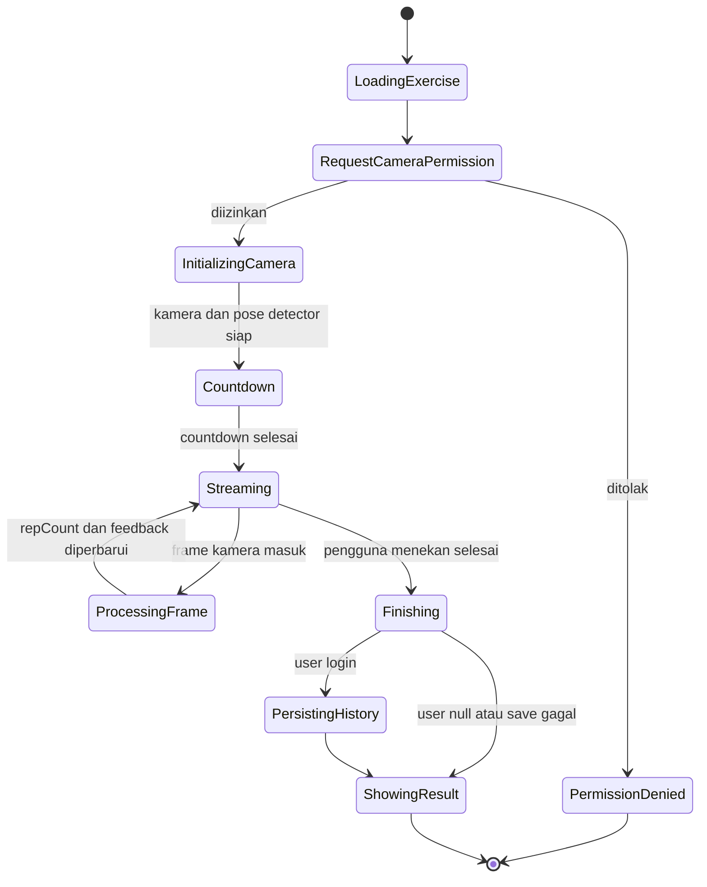
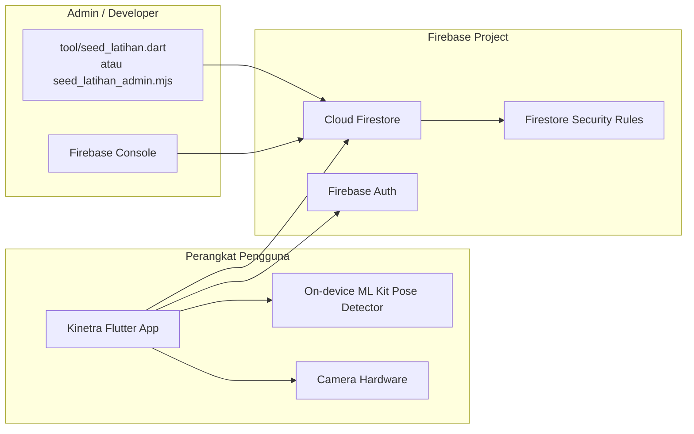
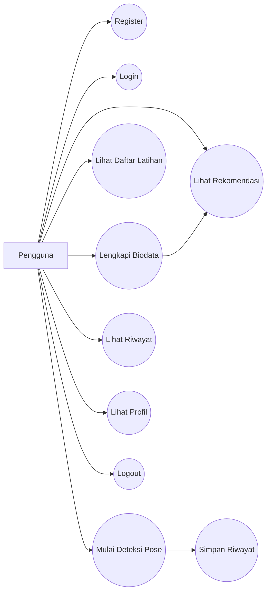

# Diagram UML Kinetra

Dokumen ini merangkum diagram UML utama untuk proyek Kinetra. Diagram ditulis dengan Mermaid agar dapat dirender langsung oleh GitHub, GitLab, dan banyak editor Markdown.

## Ringkasan Arsitektur

Kinetra adalah aplikasi mobile Flutter untuk workout assistant dengan deteksi pose real-time. Aplikasi berjalan di perangkat pengguna, memakai Firebase Auth untuk autentikasi, Cloud Firestore untuk data aplikasi, dan Google ML Kit untuk pose detection.

Struktur kode utama:

- `lib/features/`: layar dan widget per fitur.
- `lib/core/`: router, provider Riverpod, tema, konstanta, utilitas, dan widget bersama.
- `lib/domain/`: entity dan interface repository.
- `lib/data/`: model Firestore dan implementasi repository.
- `lib/logic/`: strategi penghitung repetisi per latihan.
- `lib/services/`: wrapper kamera dan pose detector.

## 1. Component Diagram

## 2. Class Diagram - Domain, Repository, dan Logic

## 3. Sequence Diagram - Alur Deteksi Workout

## 4. Activity Diagram - Guard Navigasi

## 5. State Machine Diagram - Siklus Sesi Workout

## 6. Deployment Diagram

## 7. Use Case Diagram

## Catatan Data Firestore

| Koleksi | Sumber kode | Peran |
| --- | --- | --- |
| `users` | `FirestoreCollections.users` | Profil dasar pengguna dan status biodata. |
| `biodata` | `FirestoreCollections.biodata` | Data onboarding: jenis kelamin, usia, target latihan. |
| `latihan` | `FirestoreCollections.latihan` | Katalog latihan aktif yang dibaca aplikasi. |
| `riwayatLatihan` | `FirestoreCollections.riwayatLatihan` | Hasil sesi workout pengguna. |

Aturan akses Firestore mengikuti kepemilikan `userId`: pengguna hanya dapat membaca dan mengubah dokumen miliknya sendiri, sedangkan koleksi `latihan` hanya dapat dibaca oleh pengguna terautentikasi.
